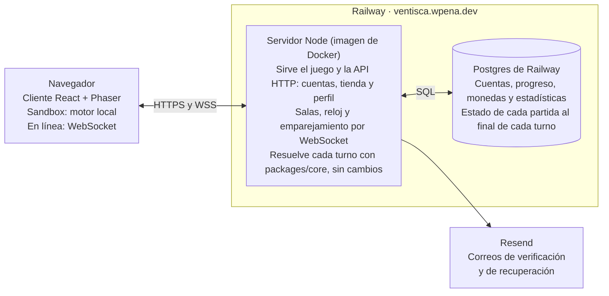

# Ventisca en línea (v2): PRD de multijugador, cuentas y progreso

Versión 1.9: aprobada para implementar · 1 de octubre de 2026 · William Andres Peña Vargas

> Documento aprobado en claude.ai el 29 de septiembre de 2026. Desde ahora esta es la versión de referencia: los cambios se hacen aquí, en el repositorio. En todo lo que toque el modo en línea, este documento manda sobre `docs/PRD.md`.
>
> Cambios: la versión 1.1 agrega la gestión de la cuenta (R-43 a R-49 y D-57), aprobada el 29 de septiembre de 2026. La 1.2 (30 de septiembre de 2026) agrega las decisiones D-51 a D-56, tomadas al empezar el M7, la 1.3 (el mismo día) agrega D-58, tomada al desplegar, la 1.4 agrega D-59, aprobada con las cuentas del servidor, la 1.5 registra cómo se envían los correos y agrega R-50, D-60 y D-61 con las cuentas del servidor, la 1.6 agrega D-62, el correo de contacto, y una tarea del M9 para avisar los cambios del aviso de privacidad, la 1.7 (1 de octubre de 2026) agrega D-64: cada push a `main` se despliega, la 1.8 (el mismo día) corrige su causa: los despliegues se saltaban por las rutas vigiladas del panel de Railway, no por las de `railway.json`, y la 1.9 agrega D-65, la comprobación de origen, y precisa las tablas del progreso.

## Resumen y alcance

Ventisca v2 agrega un modo en línea con cuentas: de 2 a 3 personas juegan juntas, cada una con un ninja, y solo ese modo da progreso.

- **Sandbox (modo solo):** siempre disponible y sin cuenta. Una persona controla a los tres ninjas con un mazo fijo. No da monedas, cartas, logros ni estadísticas.
- **En línea:** requiere cuenta con correo y contraseña. Hay salas con código para jugar con amigos y emparejamiento público. Monedas, cajas, colección, logros y estadísticas viven en la cuenta.
- **Dónde:** en ventisca.wpena.dev, todo alojado en Railway (Docker, servidor Node y Postgres), con correos por Resend.

Queda fuera de v2: chat, señales y clasificaciones públicas. El jefe final y los rangos siguen en v3. El motor de reglas no cambia: el servidor usa el mismo `packages/core`.

## Decisiones

Las decisiones están cerradas. De las diecisiete del documento aprobado, ocho se tomaron al definir la idea y nueve se aprobaron tras revisarlas una por una. Después llegaron D-57, la gestión de la cuenta; D-51 a D-56, tomadas al empezar el M7 (las herramientas del servidor se explican en el ADR 0006), D-58, tomada al desplegar, D-59, D-60 y D-61, aprobadas con las cuentas del servidor, D-62, el correo de contacto, D-64, que despliega cada push a `main`, y D-65, la comprobación de origen. La columna de estado queda como registro de cómo se decidió cada una.

| ID | Decisión | Estado |
| --- | --- | --- |
| D-34 | Dos modos: sandbox sin cuenta ni progreso, y en línea con cuenta, el único que da progreso. La progresión de R-25 a R-32 pasa del navegador a la cuenta. | Tomada |
| D-35 | Partidas en línea de 2 o 3 personas, un ninja cada una. Con 2, el bot controla el tercero. Nunca una sola persona: sin compañero no hay partida en línea (P-24). | Tomada |
| D-36 | Salas con código y emparejamiento público, las dos desde el inicio. | Tomada |
| D-37 | Todo en Railway con Docker: servidor Node autoritativo en el monorepo y Postgres. Reemplaza el plan de Cloudflare Durable Objects (§11) y el workflow de despliegue a Cloudflare. | Tomada |
| D-38 | Cuentas con correo y contraseña. Verificación y recuperación por correo con Resend. Sin límite de edad: el juego es para todo el mundo, sin verificación de edad ni autorización de adultos en v2 (P-19). | Tomada |
| D-39 | Estadísticas de combate solo del modo en línea, calculadas en el servidor. Son privadas: solo las ve cada jugador (P-21). | Tomada |
| D-40 | Dominio ventisca.wpena.dev, con un registro CNAME hacia Railway. | Tomada |
| D-41 | Público abierto en internet. | Tomada |
| D-42 | Sin comunicación, como el original: ni chat ni señales. Cada persona ve en tiempo real el plan de sus compañeros (R-35). | Aprobada |
| D-43 | Elección de ninja, como el original: cada persona elige su ninja antes de entrar a la cola, y el emparejamiento solo junta personas con ninjas distintos. En una sala, cada quien elige sin repetir. | Aprobada |
| D-44 | El emparejamiento espera 30 s a un tercer jugador. Después, las dos personas pueden empezar con un bot si ambas aceptan; mientras tanto, la búsqueda sigue. | Aprobada |
| D-45 | Si alguien se desconecta, el bot toma su ninja hasta que vuelva. | Aprobada |
| D-46 | Reloj del servidor, sin pausa: todos planifican a la vez, con 15 s por turno (el original usaba 10 s). Enmienda R-04 para el modo en línea. | Aprobada |
| D-47 | El bot juega con el mazo de referencia de su elemento: 8, 9, 10, 10, 11 y 12. | Aprobada |
| D-48 | Recompensas individuales: cada persona cobra sus rondas (D-31) y gana sus logros. Solo cobra una ronda quien estaba conectado al terminarla; el bot no cobra. | Aprobada |
| D-49 | El estado de cada partida se guarda en Postgres al final de cada turno, para reconstruir las salas tras un reinicio. | Aprobada |
| D-50 | El sandbox usa por ninja el mazo de referencia del balance (8, 9, 10, 10, 11 y 12). El mazo de una cuenta nueva, con un solo 9, apenas permite combos. | Aprobada |
| D-51 | El servidor HTTP y de WebSocket usa Fastify (ADR 0006). | Tomada |
| D-52 | El servidor usa Postgres a través de Drizzle. drizzle-kit genera las migraciones como SQL versionado en el repositorio, y se aplican al desplegar (ADR 0006). | Tomada |
| D-53 | Los mensajes del protocolo y las entradas de la API se validan con esquemas de Zod, compartidos por cliente y servidor en `packages/protocol` (ADR 0006). | Tomada |
| D-54 | Las contraseñas se guardan con Argon2id mediante @node-rs/argon2 (ADR 0006). | Tomada |
| D-55 | El progreso guardado en el navegador en v1 (camino, monedas, colección y logros) se descarta: no pasa a la cuenta, y el sandbox deja de usarlo. Los ajustes no son progreso y se conservan. | Tomada |
| D-56 | Borrar la cuenta borra la fila del usuario junto con sus sesiones, sus códigos y su progreso: perfil, colección, libro de monedas, logros y estadísticas. Su lugar en `match_players` queda anónimo, como el del bot. | Tomada |
| D-57 | Gestión de la cuenta con códigos de 6 dígitos que vencen en 15 min en todo lo que pasa por el correo, en lugar de enlaces. Contraseña de 8 a 128 caracteres con mayúscula, número y símbolo, más una lista de contraseñas comunes. Cambiar la contraseña con la sesión iniciada solo pide la actual (R-43 a R-49). | Aprobada |
| D-58 | El dominio del juego va en "Solo DNS", sin el proxy de Cloudflare: el CNAME apunta directo a Railway, que sirve el certificado. Con el proxy, Cloudflare ve todo el tráfico, inyecta su analítica en la página y agrega reportes de red hacia sus servidores, y nada de eso está declarado en el aviso de privacidad. `pnpm check:prod` lo comprueba. | Tomada |
| D-59 | Las cuentas no revelan qué correos están registrados. Registrarse y pedir un código responden igual exista o no la cuenta; si ya existía, su dueño recibe un aviso por correo. Iniciar sesión con un correo sin cuenta o con la contraseña equivocada da el mismo error y tarda lo mismo. El nombre ocupado se revisa antes que el correo, para no delatarlo. Rige también para los límites de intentos y la recuperación de la contraseña. Sin sesión, un código que no sirve (equivocado, vencido o agotado) responde siempre lo mismo: decir cuántos intentos quedan delataría la cuenta. | Aprobada |
| D-60 | Un cambio de correo se puede deshacer desde el correo anterior durante 7 días con un código (R-50), porque la recuperación (R-46) mandaría el código al correo nuevo. Deshacerlo pide una contraseña nueva, porque quien hizo el cambio conocía la anterior. | Aprobada |
| D-61 | El límite por IP sube a 50 intentos fallidos cada 15 min; el de 5 por cuenta sigue. Un salón de clase puede salir a internet por una sola IP. Solo cuentan los fallos. | Aprobada |
| D-62 | El correo de contacto del aviso de privacidad es ventisca@wpena.dev: Cloudflare Email Routing lo recibe en wpena.dev y lo reenvía al buzón del responsable, y el aviso lo declara. ventisca.wpena.dev no recibe correo: la recepción de Resend pediría un MX en ese nombre, que choca con el CNAME del juego. | Tomada |
| D-64 | Cada push a `main` se despliega, toque lo que toque: `pnpm check:prod` exige que producción corra el último commit de `main`, y con una lista de rutas vigiladas un PR solo de documentación la dejaría atrás a propósito. Por eso `railway.json` no lleva `watchPatterns`. `railway.json` es la fuente de verdad del despliegue, y en el panel de Railway deben quedar vacíos "Watch Paths", "Custom Build Command", "Custom Start Command" y "Root Directory", porque el panel puede pisarla sin que se note. Así pasó: las "Watch Paths" que dejó la importación del monorepo (`/apps/server/**`) hicieron que Railway saltara los despliegues de los PR #12 y #13, que solo tocaban `apps/web/` y documentación. | Tomada |
| D-65 | Las peticiones que cambian estado solo se aceptan desde el propio juego: deben traer el `Origin` de `APP_URL`. La cookie de sesión es `SameSite=Lax`, pero para `SameSite` todo wpena.dev es el mismo sitio, así que viaja en las peticiones que mande una página de cualquier otro subdominio; el origen sí las distingue, y una página no puede falsificarlo. Sin `Origin` decide `Sec-Fetch-Site`, y sin ninguna de las dos cabeceras la petición pasa, porque no viene de un navegador y no lleva la cookie de nadie. | Aprobada |

## Experiencia del jugador

La portada ofrece dos puertas: jugar en el sandbox sin cuenta o entrar al modo en línea. Cada recorrido es una secuencia corta y sin desvíos.

**Sandbox**

1. En la portada elige "Jugar sin cuenta".
2. Elige dificultad y ritmo del reloj, y juega con el mazo fijo (D-50).
3. Ve sus resultados sin monedas, con una invitación a crear una cuenta.

**Primera vez en línea**

1. Se registra con correo, contraseña y nombre visible, y acepta el aviso de privacidad.
2. Recibe un correo con un código de verificación; al escribirlo, la cuenta queda verificada (R-44).
3. Elige su carta de camino (D-25) y recibe el mazo inicial (R-30).
4. Llega al inicio en línea: jugar, colección, tienda y estadísticas.

**Partida con amigos (sala con código)**

1. Crea una sala y elige la dificultad; recibe un código de 6 caracteres para compartir.
2. Sus amigos entran con el código y cada quien elige su ninja, sin repetir.
3. El anfitrión inicia con 2 o 3 personas; con 2, el bot toma el ninja libre.

**Partida con desconocidos (emparejamiento)**

1. Elige dificultad y su ninja, y entra a la cola.
2. El servidor busca un equipo con ninjas distintos. Si a los 30 s solo hay dos personas, ambas pueden aceptar empezar con un bot. Con una sola persona, la búsqueda sigue hasta que llegue alguien o la cancele.
3. Ve la pantalla de equipo y empieza la partida.

Al terminar cada partida, cada persona ve sus propios resultados: monedas cobradas por ronda, logros y estadísticas actualizadas. Desde ahí puede volver a la sala o a la cola.

## Reglas del modo en línea

Las reglas de combate R-01 a R-24 no cambian; estas diez reglas nuevas cubren lo que agrega jugar en equipo.

- **R-33 Equipo.** De 2 a 3 personas, un ninja cada una. Los tres elementos siempre están en juego: el ninja sin persona lo controla el bot (§8).
- **R-34 Mazo de cada jugador.** Cada persona juega con su colección del elemento de su ninja (R-26 aplicado por jugador). Su carta de camino solo ayuda si juega ese elemento. El bot usa el mazo de referencia de su elemento (D-47).
- **R-35 Planificación simultánea.** Todos planifican a la vez y cada persona ve en tiempo real los fantasmas de sus compañeros: movimiento, objetivo y carta. El orden de resolución no cambia (R-11, D-32).
- **R-36 Reloj.** Lo lleva el servidor: 15 s por turno, sin pausa (D-46). Al vencer, cada ninja actúa con lo que su persona dejó planificado. Si todos confirman antes, el turno se resuelve de inmediato.
- **R-37 Combos entre personas.** Las cartas de distintos jugadores combinan igual que en solo (R-18), como en el original.
- **R-38 Desconexión.** El bot toma el ninja al instante y lo devuelve cuando la persona reconecta, en cualquier turno. Una sala sin personas conectadas durante 2 minutos se cierra.
- **R-39 Abandono.** Salir conserva lo ya cobrado (D-31). En v2 no hay castigo por abandonar el emparejamiento (P-22).
- **R-40 Recompensas.** Cada persona cobra sus rondas y el bonus (R-29) y gana sus propios logros. El bot no cobra ni suma estadísticas, y una persona cobra una ronda solo si estaba conectada al terminarla (D-48).
- **R-41 Sin comunicación.** Como en el original, no hay chat ni señales: lo único que cada persona comparte es su plan en curso, que el equipo ve en tiempo real (R-35).
- **R-42 Estadísticas.** Se registran por persona desde los eventos del servidor: partidas jugadas y ganadas, rondas superadas, bonus ganados, daño hecho (total y por tipo de gólem), gólems derrotados por tipo, cartas lanzadas por elemento, combos, vida curada a compañeros, reanimaciones hechas y caídas sufridas. Son privadas: solo las ve su dueño, en su perfil (P-21).

## Cuentas, seguridad y privacidad

Con público abierto, el servidor no confía en nada que llegue del cliente y guarda solo los datos necesarios.

| Tema | Cómo se resuelve |
| --- | --- |
| Registro | Correo, contraseña (R-45) y nombre visible de 3 a 16 caracteres, único y con filtro de palabras. Incluye aceptar el aviso de privacidad. No se pide la edad (P-19). |
| Contraseñas | Se guardan con Argon2id (D-54). Nunca se guardan ni se registran en claro. |
| Verificación | Código de 6 dígitos que vence en 15 min (R-43 y R-44). Sin verificar no se juega en línea. |
| Recuperación | Código de 6 dígitos por correo (R-43 y R-46). Al terminar se cierran todas las sesiones. |
| Sesiones | Cookie HttpOnly, Secure y SameSite=Lax, respaldada en Postgres, con 30 días de duración. El WebSocket se autentica con la misma cookie, porque todo va por el mismo origen. Las peticiones que cambian estado solo se aceptan desde el origen del juego (D-65). |
| Abuso | Hasta 5 intentos fallidos de contraseña cada 15 min por cuenta y 50 por IP (D-61); solo cuentan los fallos. Hasta 3 correos por hora por dirección, salvo los avisos de seguridad (R-50). Captcha en el registro (Turnstile de Cloudflare funciona sin alojar en Cloudflare). |
| Mensajes del juego | Cada mensaje se valida con un esquema (D-53), y el servidor verifica cada plan con el motor antes de aceptarlo. |
| Correo | Resend, con el subdominio ventisca.wpena.dev verificado en la región São Paulo (sa-east-1). Remitente: Ventisca <no-responder@ventisca.wpena.dev>. Sin seguimiento de aperturas ni de clics. Ningún correo lleva texto escrito por quien llena un formulario. |
| Privacidad | Datos mínimos: correo, nombre visible, progreso y estadísticas. Aviso de privacidad visible y borrado de la cuenta desde el perfil (D-56). |

### Gestión de la cuenta

Todo lo que pasa por el correo usa códigos de 6 dígitos en lugar de enlaces, y cambiar la contraseña con la sesión iniciada no necesita código.

- **R-43 Códigos por correo.** Toda verificación por correo usa un código de 6 dígitos: al registrarse, al recuperar la contraseña y al cambiar el correo. Vence a los 15 min, sirve una sola vez y admite 5 intentos. Pedir uno nuevo invalida el anterior, y solo se puede pedir otro tras 60 s. Se guarda cifrado, nunca en claro, y sigue el límite de 3 correos por hora por dirección.
- **R-44 Registro.** Correo, contraseña (R-45), nombre visible y aceptación del aviso de privacidad. La cuenta queda verificada al escribir el código (R-43); sin verificar no se juega en línea.
- **R-45 Contraseña.** De 8 a 128 caracteres, con al menos una mayúscula, un número y un símbolo, es decir, cualquier carácter que no sea letra, número ni espacio. Se permiten espacios, tildes, ñ y emojis, y no se permiten saltos de línea. Se rechazan las contraseñas más comunes y las que contengan el correo o el nombre visible. En JavaScript, con la bandera `u`: `^(?=.*\p{Lu})(?=.*\p{Nd})(?=.*[^\p{L}\p{Nd}\s]).{8,128}$`
- **R-46 Recuperar la contraseña.** Sin sesión, se pide un código al correo (R-43), se escribe en la página y se pone la contraseña nueva dos veces. Al terminar se cierran todas las sesiones, la persona entra con una sesión nueva y le llega un aviso al correo.
- **R-47 Cambiar la contraseña.** Con la sesión iniciada: la contraseña actual una vez y la nueva dos veces, sin código. Se cierran las demás sesiones, la actual sigue abierta y llega un aviso al correo. Quien olvidó la actual usa R-46.
- **R-48 Cambiar el correo.** Con la sesión iniciada: se confirma con la contraseña actual y llega un código al correo nuevo (R-43). Al escribirlo, el cambio se aplica y el correo anterior recibe un aviso. Hasta entonces, la cuenta sigue con el correo anterior.
- **R-49 Borrar la cuenta.** Con la sesión iniciada, se confirma con la contraseña actual. Se borran la cuenta, sus sesiones, códigos y progreso, y su lugar en las partidas jugadas queda anónimo, como el del bot.
- **R-50 Deshacer un cambio de correo.** El aviso al correo anterior (R-48) lleva un código de 6 dígitos para deshacer el cambio: vale 7 días, sirve una sola vez y admite 5 intentos. Deshacerlo no requiere sesión: se ingresan el correo anterior, el código y una contraseña nueva dos veces. Se restaura el correo anterior, se cierran todas las sesiones y queda la contraseña nueva, porque quien hizo el cambio conocía la anterior. Responde igual exista o no la cuenta (D-59).

Cada aviso por correo dice qué cambió y qué hacer si no fue la persona: recuperar la contraseña (R-46).

Riesgo aceptado para v2: sin límite de edad ni autorización de adultos (P-19). En Colombia, la Ley 1581 exige autorización del representante legal para tratar datos de menores de 18, y COPPA y el RGPD piden algo parecido para jugadores de otros países. Los datos mínimos, la falta de comunicación entre jugadores y las estadísticas privadas reducen el riesgo, pero no lo eliminan. Conviene revisarlo con alguien que sepa antes de que el proyecto crezca; esto no es asesoría legal.

## Arquitectura técnica

Un único servidor Node en Railway sirve el juego, la API y las partidas, y resuelve cada turno con el mismo motor puro del modo solo.

El sandbox no toca el servidor: su motor corre en el navegador, como hoy.

- **`GameHost` asíncrono.** Enviar un plan devuelve una promesa y los resultados llegan como eventos, en el sandbox y en línea. Es el cambio que Claude Code señaló en su análisis.
- **Servidor autoritativo.** El servidor valida cada plan, resuelve el turno con `resolveTurn` y envía los eventos con su hash; el cliente solo anima.
- **Reloj por hora límite.** El servidor fija la hora límite de cada turno, y el cliente muestra la cuenta regresiva corrigiendo la diferencia de relojes.
- **Una sola instancia al principio.** Las salas viven en memoria, y el estado por turno en Postgres permite reconstruirlas tras un reinicio (D-49). Escalar a varias instancias queda para después.
- **Monorepo.** `packages/core` sin cambios, `packages/protocol` y `apps/server` nuevos, y `apps/web` con el `NetworkHost`.
- **Configuración.** Variables de entorno en Railway: `DATABASE_URL`, `RESEND_API_KEY`, `SESSION_SECRET` y `APP_URL`.

## Protocolo de mensajes (borrador)

La partida viaja por WebSocket con mensajes tipados en un paquete compartido (`packages/protocol`); todo lo demás es una API HTTP. Cada mensaje lleva su tipo, la versión del protocolo y un número de secuencia.

| Dirección | Mensaje | Contenido |
| --- | --- | --- |
| Cliente → servidor | `room.create` | Dificultad |
| Cliente → servidor | `room.join` | Código de la sala |
| Cliente → servidor | `queue.join` / `queue.leave` | Dificultad y ninja elegido |
| Cliente → servidor | `queue.acceptBot` | Acepta empezar con un bot tras 30 s de espera |
| Cliente → servidor | `lobby.pick` | Ninja elegido en la sala |
| Cliente → servidor | `lobby.start` | Solo el anfitrión |
| Cliente → servidor | `plan.update` | Plan en curso, para el fantasma que ven los compañeros |
| Cliente → servidor | `plan.confirm` | Plan final del turno |
| Servidor → cliente | `queue.state` | Ninjas que faltan y oferta de empezar con un bot |
| Servidor → cliente | `lobby.state` | Personas, ninjas, código y dificultad |
| Servidor → cliente | `match.start` | Estado inicial y ninja de cada persona |
| Servidor → cliente | `turn.start` | Número de turno y hora límite del servidor |
| Servidor → cliente | `team.plans` | Fantasmas de los compañeros |
| Servidor → cliente | `turn.result` | Eventos del turno y hash del estado |
| Servidor → cliente | `player.status` | Persona conectada o reemplazada por el bot |
| Servidor → cliente | `match.end` | Resultados y monedas cobradas |
| Servidor → cliente | `error` | Código de error |

**API HTTP:** registro, inicio y cierre de sesión, verificación con código, recuperación, cambio de contraseña, cambio de correo y borrado de cuenta; perfil, colección, compra de cajas y estadísticas.

El cliente anima los eventos de `turn.result` con la misma escena de hoy y compara el hash con el que calcula; si no coincide, pide el estado completo.

## Modelo de datos en Postgres

Diez tablas cubren cuentas, progreso, partidas y estadísticas. Las monedas pasan por un libro contable, para que un pago nunca se repita tras una reconexión o un reinicio.

| Tabla | Campos clave | Para qué |
| --- | --- | --- |
| `users` | id, email único, password_hash, display_name único, email_verified_at | La cuenta; borrarla borra su progreso (D-56) |
| `sessions` | id, user_id, expires_at | Sesiones con cookie |
| `email_codes` | hash del código, user_id, propósito (verificar, recuperar o cambiar correo), correo nuevo (solo al cambiarlo), intentos, expires_at y used_at | Códigos de un solo uso (R-43) |
| `profiles` | user_id, coins, camino_element, boxes_opened | Estado del progreso. La fila nace al elegir la carta de camino (R-30), y el saldo no puede ser negativo |
| `collection` | user_id, card_id, count | Cartas y duplicados (R-26) |
| `coin_ledger` | user_id, match_id, round, amount; única por (user_id, match_id, round) | Cobro por ronda sin duplicados (D-31). `match_id` apuntará a `matches` cuando existan las partidas (M8) |
| `achievements` | user_id, achievement_id, unlocked_at | Logros |
| `matches` | id, room_code, difficulty, seed, status, turn, state_snapshot (jsonb), hash | Partidas y su estado por turno (D-49) |
| `match_players` | match_id, user_id (vacío para el bot o para una cuenta borrada, D-56), ninja, joined_at, left_at | Quién jugó qué ninja |
| `player_stats` | user_id y un contador por cada estadística de R-42; los desgloses por gólem y por elemento en jsonb | Estadísticas en línea |

Las migraciones viven en el repositorio y se aplican al desplegar. Se generan con drizzle-kit (D-52). Cada tabla llega con la función que la usa: en el M7 existen las de cuentas y `profiles`, `collection` y `coin_ledger`; `achievements` llega con los logros por persona (M8).

## Hitos M7 a M9

Tres hitos en orden, cada uno publicable por sí solo: primero las cuentas, luego la partida en línea y al final el emparejamiento. Un hito termina cuando su lista está completa y `pnpm run ci` y `pnpm e2e` están en verde.

**M7: Cuentas y servidor** (todavía sin multijugador)

- [x] Una imagen de Docker con cliente y servidor, desplegada en Railway con Postgres y servida en ventisca.wpena.dev con HTTPS
- [x] Registro, verificación con código, inicio de sesión, recuperación, cambio de contraseña y de correo, y borrado de cuenta (R-43 a R-50)
- [ ] Progreso en la cuenta: carta de camino, monedas, cajas y colección (R-25 a R-32 resueltos en el servidor)
- [x] Sandbox con el mazo fijo (D-50) y sin progreso
- [x] `GameHost` asíncrono, con el sandbox funcionando igual que hoy
- [x] Pruebas del servidor (cuentas y economía sin cobros duplicados) y e2e de registro e inicio de sesión

**M8: Partida en línea**

- [ ] Medir en el simulador cómo les va a los equipos de colecciones mezcladas y decidir la curva (P-20), antes de programar las partidas
- [ ] Salas con código para 2 o 3 personas, con el bot en el ninja libre
- [ ] Reloj del servidor de 15 s (D-46) y planificación simultánea con fantasmas compartidos
- [ ] Cobro por ronda solo para quien estaba conectado (D-31 y D-48) y logros por persona
- [ ] Desconexión y reconexión, estado guardado por turno y recuperación tras un reinicio
- [ ] Pruebas con dos y tres clientes en local, reconexión y reinicio del servidor a mitad de partida

**M9: Emparejamiento y estadísticas**

- [ ] Cola por dificultad y ninja: solo junta personas con ninjas distintos y muestra qué ninjas faltan (D-43)
- [ ] A los 30 s sin tercer jugador, las dos personas pueden aceptar empezar con un bot (D-44)
- [ ] Estadísticas privadas por persona, en su perfil (R-42)
- [ ] Aviso de privacidad publicado y pruebas con personas
- [ ] Un mecanismo para avisar los cambios del aviso de privacidad: un aviso en el juego al entrar y un correo a todas las cuentas. Debe existir antes del próximo cambio del aviso, porque el aviso lo promete en "Cambios"

## Preguntas abiertas y riesgos

P-19, P-21, P-23 y P-24 están resueltas, y P-22 queda para cuando haya datos de uso. Solo sigue abierta P-20, la curva de dificultad con equipos de colecciones mezcladas, que Claude Code mide antes del M8.

**Preguntas abiertas**

- [x] **P-19 Edad mínima.** Resuelta para v2: sin límite de edad y sin autorización de adultos (D-38). El riesgo legal queda anotado en la sección de cuentas.
- [ ] **P-20 Curva de dificultad en línea.** Un mismo equipo puede juntar una colección nueva con una completa. Claude Code extiende el simulador con equipos mezclados y lo mide antes del M8; la curva se decide con esos números.
- [x] **P-21 Visibilidad de las estadísticas.** Resuelta: solo las ve cada jugador. En v2 no hay perfil público ni clasificación.
- [ ] **P-22 Castigo por abandono.** En v2 no hay castigo. Se decide con datos de uso una vez abierto el emparejamiento.
- [x] **P-23 Mazo del sandbox.** Resuelta: el bot y el sandbox usan el mismo mazo de referencia (D-47 y D-50).
- [x] **P-24 Jugar en línea en solitario.** Resuelta: no. Hacen falta al menos dos personas; quien está solo juega el sandbox (D-35).

**Riesgos**

| Riesgo | Mitigación |
| --- | --- |
| Railway cobra por uso: servidor encendido todo el día más Postgres | Revisar el plan y el consumo antes de abrir el registro al público |
| Registros masivos y uso del registro para enviar correo basura | Límites por IP y por dirección, captcha y verificación obligatoria |
| Colas vacías o desparejas: pocos jugadores, o casi todos con el mismo ninja | Salas con código desde el inicio, un contador de personas buscando partida, la lista de ninjas que faltan y el sandbox siempre disponible |
| Reinicios del servidor durante partidas | Estado guardado por turno y reconstrucción de salas (D-49) |
| Alcance grande para un proyecto de clase | Hitos publicables por separado: el M7 ya aporta valor solo |
