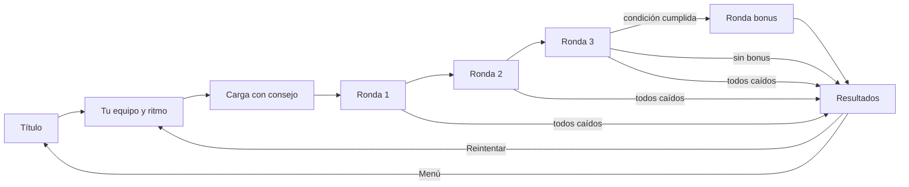
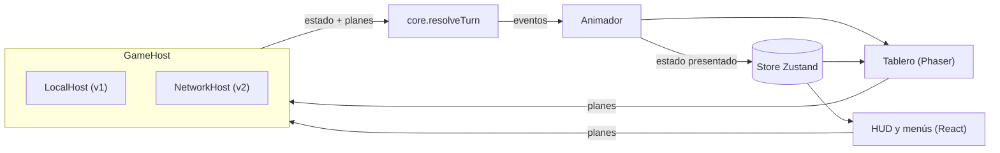

# PRD — Proyecto Ventisca

> Táctico cooperativo por turnos inspirado en **Card-Jitsu Snow** (Club Penguin, 2013).
> Mecánica fiel al original. Nombre, personajes, arte y audio 100 % propios.

| Campo | Valor |
|---|---|
| Versión | 0.9.5 |
| Última actualización | 29 de septiembre de 2026 |
| Estado | 🟢 v1 jugable de punta a punta: M0 a M5 completos, M6 en curso |
| Dueño de producto | _(tu nombre)_ |
| Contexto | Proyecto de clase: recrear con IA el juego favorito de la infancia |
| Nombre | "Proyecto Ventisca" es un nombre en clave provisional (P-05) |

### Estado rápido

- [x] Investigación de mecánicas, diseño y animaciones del original (§4)
- [x] Especificación de reglas (§7), ajustada a controlar los 3 ninjas
- [x] Alcance de v1: single player controlando a los 3 ninjas, sin fecha fija (D-08, D-10)
- [x] Stack tecnológico elegido tras investigación (§11.1, D-09)
- [x] Dirección de arte: Propuesta A "Pliegues", generada en código (P-04, D-15)
- [x] M0 a M5: motor, combate, rondas, cartas y combos, bonus, bot, balance y presentación
- [x] Versión jugable publicada como página (privada hasta que decidas compartirla): https://claude.ai/artifact/5ybgwXexsxGhdbZvSoYxrV
- [ ] M6: playtest con personas, QA en Firefox y Safari, táctil, Cloudflare e itch.io, video
- [x] Diseño de la progresión (§18): monedas, cajas, colección e inventario inicial, respaldado con datos del original y simulación
- [x] Progresión implementada (§18): carta de camino, colección, tienda con cajas y monedas por ronda
- [x] Animación fase 1 (§10.2): esqueletos articulados de papel con 10 estados por ninja y 7 por gólem
- [x] Animación fase 2 (§10.2): efectos de impacto, cinemáticas de carta, ataques de gólems con aviso y efectos de estado persistentes
- [x] Animación fase 3 (§10.2): coreografía medida con metas de ritmo, animaciones rápidas y aceleración manteniendo Espacio
- [x] Animación fase 4 (§10.2): cartas que vuelan a la mano, medidor y vida animados, transiciones entre pantallas y resultados que cuentan. Plan de animación completo

### Estado de implementación (v0.9.5)

| Área | Estado | Evidencia |
|---|---|---|
| Motor de reglas R-01 a R-24 | ✅ | 44 pruebas de reglas en `packages/core/test/rules.test.ts`, nombradas por regla (incluye el orden de resolución de D-32). De R-01 a R-30, todas tienen prueba propia; R-31 y R-32 esperan a v2 |
| Estado presentado (animación evento por evento) | ✅ | Prueba que lo compara con el motor en partidas completas. e2e: una animación interrumpida no aplica eventos a la partida nueva |
| Bot y simulador | ✅ | `pnpm sim` mide con la colección real (`--collection`) y reproduce la tabla del §18.3 (`--table`). Reporte en `docs/balance-report.md` |
| Cliente web (escena, HUD, pantallas, logros, pausa, ayuda) | ✅ | 12 pruebas e2e de Playwright: humo, partida completa, tienda, teclado (mantener Espacio o Tab no repite acciones; deshacer no deja planes vacíos), reinicio a mitad de una animación, cobro por ronda de D-31 (salir tras la ronda 1, abandonar en la 2 y salir durante la celebración) y aviso sin WebGL. Los ajustes guardados se validan al cargarlos. Las 3 de v0.9.1 pasan también en WebKit y Firefox |
| Arte y audio originales | ✅ | SVG y WebAudio generados en código (ADR 0003) |
| Build en un solo HTML | ✅ | 1,7 MB (478 KB gzip), sin peticiones salvo Google Fonts |
| CI y despliegue | 🟡 | CI en verde en GitHub Actions (github.com/ZyFalo/card-game-snow). Despliegue pendiente: Railway, hito M7 |
| Interfaz (fase 4 de animación) | ✅ Implementada | Capturas con las animaciones congeladas en un punto exacto; partida completa con robos reales; e2e |
| Coreografía (fase 3 de animación) | ✅ Implementada | Estimador de ritmo sobre partidas del bot; 3 pruebas con metas; partida completa acelerando con Espacio |
| Efectos (fase 2 de animación) | ✅ Implementada | Prueba de texturas de efectos; capturas por instante de cada efecto en el tablero real; ninguna secuencia se bloquea. e2e: reiniciar a mitad de una carta no deja efectos vivos |
| Animación por esqueletos (fase 1) | ✅ Implementada | 2 pruebas de consistencia de esqueletos y clips; hoja de poses en el tablero real; partida completa y secuencia de caída, reanimación, aturdido y explosión sin errores |
| Progresión: monedas, cajas y colección | ✅ Implementada | 9 pruebas de R-25 a R-30 (incluye el pago por ronda de D-31), más 4 de las colecciones del simulador; e2e de camino y de compra de cajas; partida completa cobrando monedas |
| Validación con personas | ⬜ | Pendiente (meta en `docs/balance-report.md`) |

---

## 0. Cómo usar este documento

Este PRD es la fuente única de verdad. Si algo no está aquí, no está decidido.

**Convenciones**

- ✅ Decidido
- ❓ Pendiente
- 🧪 Valor a ajustar con playtest
- 📌 Supuesto vigente hasta que se diga lo contrario

**Identificadores estables:** `R-xx` reglas, `P-xx` preguntas, `D-xx` decisiones, `M-x` hitos. Úsalos en issues, commits, nombres de tests y prompts (ejemplo: *"implementa R-12 con tests"*).

**Mantenimiento:** cada cambio sube la versión y agrega una línea al Changelog (§17). Cada decisión nueva entra al registro (§16). Las casillas `[ ]` de los hitos (§13) se marcan al cumplir su criterio de aceptación.

**Separación importante:** la §4 describe el juego original (investigación). Lo que construimos está especificado desde la §5 en adelante.

---

## 1. Resumen ejecutivo

Tres ninjas elementales (Fuego, Agua y Nieve) defienden una cima nevada en un tablero de 9×5 casillas. En cada turno se planifica para cada ninja, contra el reloj, un movimiento y una acción: atacar, curar, revivir a un compañero o jugar una carta de poder. En v1 el jugador controla a los tres; en multijugador cada persona controla al suyo, como en el original. Luego el turno se resuelve con animaciones y responden los enemigos. Si dos o más ninjas juegan carta en el mismo turno se desata un **combo**. Una partida son 3 rondas y, si el equipo cumple una condición sorteada al inicio, una ronda bonus.

**Estrategia de entrega**

| Fase | Qué | Para quién |
|---|---|---|
| v1 | Single player en el navegador, controlando a los 3 ninjas | Entrega de la clase |
| v2 | Multijugador con amigos (salas privadas de 1 a 3 personas) | Tú y tus amigos |
| v3 | Jefe final, mentor aliado y progresión | Versión "completa" |

**Decisión estructural desde el día 1:** las reglas viven en un módulo puro y determinista, separado del render. En v1 corre en el navegador; en v2 corre sin cambios en el servidor. Así el multijugador es un cambio de transporte y no una reescritura.

---

## 2. Principio rector: fiel en mecánica, original en identidad — ✅ D-01

**Replicamos con la mayor fidelidad posible:** reglas, números de balance, estructura de turnos y rondas, patrones de interacción (planificar con un "fantasma", reloj con confirmación, mano de cartas, cinemática de combo, banner de ronda) y el ritmo de las animaciones.

**Creamos desde cero:** nombre, historia, personajes, enemigos, jefe, mentor, arte, logo, estilo de UI, música, efectos de sonido y textos.

**Reglas de proceso**

1. Ningún asset se extrae, calca, convierte o "limpia" del juego original ni de servidores o repositorios de fans (varios redistribuyen los archivos originales).
2. Los prompts para generar arte o audio nunca mencionan el juego original, sus personajes ni "su estilo".
3. Los nombres del original solo aparecen en este documento como referencia de investigación (encabezado, §4 y apéndices); nunca dentro del juego.

**Por qué:** el proyecto se puede mostrar sin depender de material de terceros (clase, repositorio público, portafolio), y la identidad propia se puede diseñar y generar con IA sin restricciones.

---

## 3. Objetivos, no-objetivos y métricas

### 3.1 Objetivos de v1

- **G1.** Una partida completa (3 rondas + bonus condicional) jugable de principio a fin en single player.
- **G2.** Fidelidad mecánica: las reglas de la §7 reproducen los valores del original (§4 y Apéndice A).
- **G3.** Que "se sienta" como el original: planificación simultánea con reloj, combos con cinemática, feedback claro de cada golpe.
- **G4.** Arquitectura lista para multijugador: motor de reglas determinista y "host" intercambiable (§11).
- **G5.** Proceso de desarrollo con IA documentado, como evidencia para la clase (§12, P-09).

### 3.2 No-objetivos de v1

- Multijugador en línea (llega en v2).
- Jefe final, mentor aliado, rangos y recompensas cosméticas (v3).
- Cuentas de usuario, base de datos, monetización, app nativa.
- La carta de revivir de pago del original (ver §4.7).

### 3.3 Métricas de éxito

| Métrica | Meta |
|---|---|
| Duración de una partida de 3 rondas | 6 a 12 minutos en ritmo Normal 🧪 |
| Rendimiento en una laptop promedio (navegador) | 60 FPS estables |
| Carga inicial | Menos de 5 s en una conexión normal |
| Determinismo | 100 % de las repeticiones (misma semilla + mismos planes) producen el mismo hash de estado |
| Cobertura de tests del motor de reglas | 80 % o más |
| Playtest con 3 o más compañeros | 70 % o más responde que "se siente como el original" |

---

## 4. Investigación: cómo funcionaba el original

Fuentes principales (detalle en el Apéndice B): la Club Penguin Wiki y el código de **Snowflake**, una reimplementación fan del servidor del juego (licencia MIT). Snowflake se usó solo para extraer valores y comportamiento; no se reutiliza su código ni sus assets. Donde las fuentes discrepan se indica, y la decisión nuestra está en §4.12.

### 4.1 Visión general

- Beta pública desde el 28 de febrero de 2013 y lanzamiento el 23 de mayo de 2013; fue el último juego de la saga Card-Jitsu y el único cooperativo. Estuvo disponible hasta el cierre de Club Penguin (marzo de 2017).
- Exigía exactamente 3 jugadores, uno por elemento, contra tres tipos de minions de nieve. Tras completar el traje de nieve se desbloqueaba la batalla contra el jefe.
- Tablero de 9 columnas × 5 filas. Los ninjas empiezan a la izquierda y los enemigos a la derecha.
- Partida de 3 rondas, cada una con 1 a 3 enemigos. La ronda termina al derrotarlos a todos. La partida se pierde si los 3 ninjas quedan fuera de combate al mismo tiempo.
- Escenarios de combate: cima de la montaña, valle de riscos y bosque, más la guarida del jefe.
- **Dato técnico relevante:** según la reimplementación (que es compatible con el cliente original), el servidor era autoritativo: reloj, IA, resolución de turnos e incluso la secuencia de animaciones se orquestaban desde el servidor; el cliente solo dibujaba. Esto valida la arquitectura propuesta para v2 (§11).

### 4.2 Estructura del turno

1. **Planificación (10 s).** Cada jugador elige una casilla de destino (aparece un "fantasma" semitransparente, visible para los compañeros) y luego una acción, calculada desde esa casilla. El reloj termina antes si todos confirman. Cuando quedan 3 s aparece un aviso para confirmar. Si el reloj llega a 0 se ejecuta lo que cada uno alcanzó a elegir.
2. **Resolución**, en este orden:
   1. Todos los ninjas se mueven.
   2. Ataques y curas básicas.
   3. Cartas de poder. Si hay 2 o más, primero se muestra la cinemática de combo.
   4. Carta de revivir de pago (solo miembros).
   5. Cada enemigo, uno por uno, se mueve y ataca. Los aturdidos pierden el turno.
   6. Se completan las reanimaciones (si el reanimador cayó durante la fase enemiga, se cancela). En Ventisca esto cambia: ver D-18.
   7. Las quemaduras del combo de fuego hacen su daño.
   8. Se verifica si terminó la ronda o la partida.

### 4.3 Clases de ninja

| Elemento | HP | Daño | Alcance | Mov. | Habilidad | Carta de poder | Efecto de combo |
|---|---|---|---|---|---|---|---|
| Agua | 40 | 10 | 1 | 2 | — | Daño ×2 a los enemigos del área | Potencia: el próximo ataque o cura de cada ninja hace +50 % |
| Fuego | 30 | 8 | 2 | 2 | — | Daño + aturdimiento a los enemigos del área | Quemadura: 3 de daño extra por turno durante 3 turnos |
| Nieve | 25 | 6 | 3 | 3 | Cura 6 a un aliado | Daño a enemigos y cura a ninjas del área (valor de la carta) | Escudo: cada ninja bloquea por completo el próximo golpe |

- Todas las distancias son Manhattan (el área de alcance es un rombo).
- Nieve no puede curarse a sí misma con la acción básica.
- Cualquier ninja puede revivir a un aliado caído que esté en una de sus 8 casillas vecinas (diagonales incluidas).

### 4.4 Enemigos

| Nombre original | Arquetipo | HP | Daño | Alcance | Mov. | Especial |
|---|---|---|---|---|---|---|
| Sly | Francotirador | 30 | 3–5 | 3 | 3 | +1 de daño por cada casilla de distancia más allá de la primera (de 3 a 5) |
| Scrap | Artillero | 45 | 8 | 2 | 2 | 4 de daño a los ninjas en las 8 casillas vecinas del objetivo |
| Tank | Coloso | 60 | 10 | 1 | 1 | Golpe de 3 casillas: también daña a los ninjas "hombro con hombro" con el objetivo, en perpendicular al golpe (wiki: 10; reimplementación: 5) |
| Tusk | Jefe estático | 800\* | 10 | Todo el tablero | 0 | Carámbanos en casillas aleatorias, ataque a 2 filas vecinas y muro de nieve que empuja a todos a la izquierda |

\* Con 3 jugadores. La reimplementación lo escala a 500 con 2 y a 300 con 1.

- Rondas 1 a 3: entre 1 y 3 enemigos al azar. Ronda bonus: 4. Nunca más de 3 del mismo tipo.
- Aparecen en una casilla libre aleatoria de las dos columnas de la derecha.
- **IA enemiga (reimplementación):** evalúa cada casilla alcanzable, incluida la actual; para cada una calcula a qué ninjas podría golpear; elige la combinación casilla + objetivo que más daño total produce (incluye salpicaduras); desempata al azar. Si no alcanza a nadie, se acerca al ninja más cercano. Nunca ataca ninjas caídos. El propio autor anota que ese acercamiento se puede atascar detrás de obstáculos y sugiere usar pathfinding real.

### 4.5 Medidor y cartas de poder

- El medidor sube 2 puntos cada vez que el ninja se mueve, realiza una acción (excepto jugar carta) o recibe un golpe. Al llegar a 10 se reparte una carta aleatoria de su elemento.
- Máximo 4 cartas en mano; con la mano llena hay que jugar una para recibir la siguiente.
- Las cartas venían de la colección del jugador, así que eran finitas (las capturas muestran jugadores con 4 y con 6 cartas). Cada carta tiene un valor numérico; en las capturas se ven 10 y 12.
- Jugar una carta reemplaza la acción del turno. Se coloca en una casilla del área resaltada (en la reimplementación: a distancia no mayor al movimiento del ninja, desde su posición planificada) y afecta un área de 3×3, recortada en los bordes.

### 4.6 Combos

- Si 2 o más ninjas juegan carta en el mismo turno se muestra una cinemática de combo con los participantes; después cada carta aplica su efecto normal más su efecto de combo (tabla de §4.3).
- Contra el jefe, la carta del mentor aliado también cuenta, lo que permite combos de 4.

### 4.7 Caída y reanimación

- Con 0 HP el ninja queda atrapado en la nieve: sigue ocupando su casilla, no actúa y los enemigos lo ignoran.
- Revivir consume la acción del reanimador. En la reimplementación de referencia se completa al final del turno, después de los enemigos, y el revivido vuelve con 1 HP. **Nuestra decisión (D-18):** se completa en el acto, antes de la fase enemiga, así que el revivido puede volver a caer ese mismo turno.
- Las cartas de Nieve curan a quien esté en su área, lo que también revive a los caídos.
- Desde agosto de 2013 los miembros tenían una carta extra que revivía o curaba al 100 % una vez por partida (fuera de alcance para nosotros).

### 4.8 Ronda bonus

- Al iniciar la partida se sortea **una** condición y se muestra en el banner de ronda: (a) ningún ninja cae en toda la partida, (b) todos con vida completa al terminar la ronda 3, o (c) terminar las 3 rondas antes de un límite de tiempo (wiki: unos 4 minutos; reimplementación: 5 minutos). En tus capturas se ve una cuenta regresiva de 4:03 durante la ronda 1.
- Si se cumple, se juega una ronda extra contra 4 enemigos.

### 4.9 Batalla contra el jefe (referencia para v3)

- El jefe no se mueve, ocupa un bloque de 2×3 casillas en el borde derecho y puede golpear cualquier casilla.
- Rota entre tres ataques: lluvia de carámbanos en casillas aleatorias, golpe a dos filas vecinas (recorre el tablero en ciclo) y un muro de nieve que empuja a todos los ninjas, caídos incluidos, a la columna izquierda. Mientras más cerca estén los ninjas, más probable es el empuje.
- Un mentor aliado ocupa la casilla central izquierda y juega una carta cada 3 turnos, rotando nieve → fuego → agua, con impactos en tres puntos fijos de la fila central.

### 4.10 Recompensas y progresión (referencia para v3)

- Monedas por ronda superada: 60 / 120 / 120, más 120 por la bonus. Experiencia: 100 / 200 / 300, más 180 por la bonus (reimplementación).
- 24 rangos. En el rango 13 se obtenía la gema que desbloqueaba al jefe; los rangos intermedios daban piezas de ropa y videos de historia.
- Unas 21 estampillas (logros) en cuatro dificultades: ganar rondas con cada elemento, revivir, combos de 3, curar 15 veces en una partida, golpear 3 enemigos con una sola carta, ganar la ronda bonus, etc.

### 4.11 Patrones de UX observados en tus capturas

| Pantalla | Qué hace (función, no estilo) |
|---|---|
| Arte principal | Presenta a los tres ninjas y el título |
| Selección de elemento | Barras de stats (movimiento, alcance, daño), cantidad de cartas que tienes, qué hace tu carta y tu combo, casilla "modo consejos", flechas para cambiar de elemento y botón para jugar |
| Carga | Un consejo de juego al azar mientras se emparejan los jugadores |
| Banner de ronda | Progreso 1 → 2 → 3 → Bonus y la condición para desbloquear el bonus, con cuenta regresiva si es por tiempo |
| Planificación | Casillas de movimiento resaltadas, fantasma en el destino, objetivos marcados, marca de "listo" sobre quien confirmó, reloj con botón de confirmar arriba |
| Carta de poder | Área de colocación resaltada, patrón 3×3 bajo el cursor e indicadores sobre los enemigos que serán alcanzados (interpretación de la captura) |
| Combo | Rótulo de combo y cinemática a pantalla completa con los participantes |
| Logros | Notificación discreta en una esquina |
| Consejos | Tooltip contextual por fase (mover, atacar, carta, curar, confirmar) |

La versión móvil de la época adaptaba la misma interfaz a pantalla táctil.

### 4.12 Huecos y discrepancias → nuestra decisión

| Tema | Wiki | Reimplementación | Nuestra decisión |
|---|---|---|---|
| Daño lateral del coloso | 10 | 5 | 10 🧪 (R-13) |
| Límite de tiempo del bonus | ~4 min | 5 min | Límite en turnos, N 🧪 (R-21, D-12) |
| HP al revivir | Sin dato | 1 | 1 🧪 (R-09) |
| Bloqueo de caminos | Un consejo del juego sugiere que bloquear sirve | Los ninjas "saltan" a cualquier casilla libre en rango; los enemigos hacen un chequeo simple de obstáculos | Camino real (BFS) y bloqueo entre bandos 🧪 (D-04, R-05) |
| Rango para colocar carta | "Casillas resaltadas" | ≤ movimiento | ≤ movimiento 🧪 (R-16) |
| Carta con la mano llena | Hay que jugar una para recibir otra | El medidor se reinicia y la carta se pierde | El medidor queda lleno hasta liberar espacio (R-15) |
| Mazo de cartas | Colección del jugador | Colección del jugador | Mazo fijo de 6 por clase 🧪 (R-16, D-07) |
| Línea de visión | Sin dato | Rocas bloquean solo a enemigos, en línea recta | Ningún ataque requiere línea de visión 📌 (D-05) |

---

## 5. Visión de nuestro juego

### 5.1 Premisa y elenco — ❓ P-04, P-05

Dos propuestas de identidad original. Ambas conservan lo que hace funcionar al juego (tres roles legibles a simple vista, montaña nevada, enemigos de hielo, cartas elementales) sin parecerse al original.

**Propuesta A — "Pliegues" (recomendada).** En lo alto del Paso Ventisca, una vieja maestra plegadora dobla tres aprendices de papel y entinta a cada uno con un elemento. Cuando una tormenta despierta a los gólems de escarcha de la montaña, los aprendices tienen que aprender a pelear juntos.

| Rol | Nombre provisional | Idea visual |
|---|---|---|
| Ninja de Fuego | Brasa | Figura de papel entintada en rojo; lanza proyectiles en arco |
| Ninja de Agua | Marea | Figura robusta de papel azul; golpea cuerpo a cuerpo |
| Ninja de Nieve | Escarcha | Figura esbelta de papel menta; ataca de lejos y cura |
| Francotirador | Carámbano | Gólem delgado que dispara esquirlas de hielo |
| Artillero | Granizo | Gólem que lanza bolas de granizo que estallan |
| Coloso | Témpano | Gólem enorme y lento de hielo compacto |
| Jefe (v3) | Rey Glaciar | Gólem colosal incrustado en la montaña |
| Mentora (v3) | Maestra Grulla | La plegadora que entrenó a los aprendices |

Por qué la recomiendo: conecta con las "cartas" (todo es papel), da siluetas muy distintas por rol, es fácil de producir con IA en vectores planos, se anima bien por piezas (cutout) y regala momentos propios: al caer, el ninja se arruga y se empapa de nieve; al revivir, se vuelve a doblar.

**Propuesta B — "Bestiario de montaña".** Tres animales de montaña con técnicas elementales (por ejemplo, un macaco de las nieves para Fuego, un oso pardo para Agua y un zorro ártico para Nieve) contra espíritus de ventisca. Más cálida y expresiva, pero más costosa de animar y de mantener consistente con IA.

### 5.2 Pilares de diseño

1. **Juntos o nada.** Roles complementarios; ninguna clase gana sola.
2. **Coordinar a tres contra el reloj.** El jugador es el equipo: planifica tres roles distintos en el mismo turno y el reto está en sincronizarlos.
3. **El combo es el clímax.** Es el momento que más se pule, en arte, sonido y ritmo.
4. **Partidas cortas.** Unos 10 minutos, con ganas de "una más".

### 5.3 Glosario

| Término | Significado |
|---|---|
| Casilla | Celda del tablero de 9×5 |
| Fantasma | Previsualización semitransparente del destino planificado |
| Acción | Lo único que el ninja hace además de moverse: atacar, curar, revivir o jugar carta |
| Medidor | Barra que se llena al actuar y recibir golpes; al llenarse da una carta |
| Mano | Cartas disponibles (máximo 4) |
| Combo | 2 o más cartas jugadas en el mismo turno |
| Caído (KO) | Ninja con 0 HP, atrapado en la nieve |
| Revivir | Acción de un aliado adyacente para levantar a un caído |
| Aturdido | Enemigo que pierde su siguiente turno |
| Quemado | Enemigo que recibe daño al final de cada turno durante 3 turnos |
| Potencia | El próximo ataque o cura básica hace +50 % |
| Escudo | Anula por completo el próximo golpe recibido |
| Ninja activo | El ninja que estás planificando en este momento |
| Ritmo | Duración del reloj del turno: Relajado, Normal o Experto |

---

## 6. Alcance por fases

| Fase | Contenido | Hitos |
|---|---|---|
| **v1 — Single player** (entrega de clase) | Reglas completas de §7, control de los 3 ninjas con ritmos de reloj, IA enemiga, 3 rondas + bonus, pantallas de §9, arte y audio originales | M0 a M6 |
| **v2 — Multijugador** | Salas privadas con código para 1 a 3 personas; cada una controla uno o más ninjas; reconexión; bots opcionales | M7 a M9 |
| **v3 — Jefe y progresión** | Jefe y mentora, rangos, recompensas, logros persistentes | M10+ |

### 6.1 Alcance de v1 — ✅ D-08

- **Imprescindible:** R-01 a R-24, planificación de los 3 ninjas con ritmos (§9.3), un mapa, IA enemiga, pantalla "Tu equipo", banner de ronda y pantalla de resultados.
- **Importante:** cinemática de combo, consejos contextuales, arte original, efectos de sonido y bot de simulación para balancear (§8).
- **Deseable:** 3 mapas, logros locales, tutorial interactivo, música original, botón "sugerir jugada" con el bot.
- **Fuera de v1:** multijugador, jefe, progresión, cuentas.

### 6.2 Sin fecha fija: cómo evitamos que el proyecto se alargue — ✅ D-10

- Cada hito tiene una caja de tiempo (las estimaciones de §13). Si se pasa en más de 50 %, se recorta su alcance y lo pendiente va al backlog.
- Tres puntos de demostración:
  - **Demo 1** (fin de M1): combate básico jugable.
  - **Demo 2** (fin de M3): corte vertical con cartas y combos, ideal para mostrar avance en clase.
  - **v1** (fin de M6): arte original, audio y enlace público.
- Nada de v2 o v3 entra antes de cerrar v1, salvo lo que ya exige la arquitectura (motor determinista y host intercambiable).

---

## 7. Reglas del juego (especificación)

Los valores numéricos viven en configuración (Apéndice A) para poder balancear sin tocar código.

### Tablero y aparición

- **R-01 Tablero.** 9 columnas × 5 filas. Coordenadas `(x, y)` con `x` de 0 a 8 (izquierda a derecha) e `y` de 0 a 4 (arriba a abajo). Una unidad por casilla. Distancia = Manhattan. "Vecinas" = las 8 casillas alrededor (diagonales incluidas).
- **R-02 Aparición.** Los ninjas empiezan en `x = 0`, filas 0, 2 y 4, en orden aleatorio. Conservan su posición entre rondas. Los enemigos aparecen en casillas libres aleatorias con `x` en 7 u 8.
- **R-03 Obstáculos.** Cada mapa define rocas; por defecto en (2,0), (6,0), (2,4) y (6,4). Nadie puede entrar ni pasar por una roca. Las rocas no bloquean ataques.

### Turno

- **R-04 Planificación y ritmo.** El reloj del turno da 10 s por cada ninja en pie que controla una misma persona 🧪 (D-11): un ninja caído no tiene nada que planificar, así que no suma tiempo. En v1, donde el jugador controla a los 3, son 10 s por ninja en pie (30 s con los tres); en multijugador, 10 s con un ninja por persona, como el original. En single player se elige ritmo: *Relajado* (sin reloj), *Normal* (10 s por ninja en pie, 30 s con los tres; por defecto) o *Experto* (5 s por ninja en pie, 15 s con los tres). Cada ninja en pie recibe como máximo un movimiento y una acción; la acción se calcula desde su casilla planificada. Los planes se pueden cambiar hasta confirmar el turno; cuando todos los jugadores confirman (en v1, el único), el reloj termina. A los 3 s restantes se avisa. Al llegar a 0 se ejecuta lo elegido, las selecciones incompletas se descartan y un ninja sin plan no hace nada. Todos los fantasmas y objetivos son visibles en tiempo real.
- **R-05 Movimiento.** El destino debe estar a una distancia de camino no mayor al movimiento de la clase, calculada con BFS en 4 direcciones. Cada bando puede atravesar a sus aliados pero no a sus rivales ni a las rocas. El destino debe estar libre al inicio del turno y no puede estar reservado por el fantasma de otro aliado (el primero en reservar gana). Moverse es opcional.
- **R-06 Acciones.** Una por turno y opcional: atacar, curar (solo Nieve), revivir o jugar carta. Si al resolverse el objetivo ya no es válido (por ejemplo, otro ninja lo derrotó), la acción se pierde sin efecto.
- **R-07 Ataque básico.** Objetivo: un enemigo a distancia no mayor al alcance desde la casilla planificada. Daño igual al daño de la clase, ×1,5 con Potencia. No requiere línea de visión.
- **R-08 Curación (Nieve).** Objetivo: un aliado en pie, herido, distinto de sí misma y a distancia no mayor a 3. Cura 6, ×1,5 con Potencia.
- **R-09 Revivir.** Objetivo: un aliado caído en una de las 8 casillas vecinas a la casilla planificada. Cualquier clase puede revivir. Se completa en el acto, dentro del paso 2 de R-11: el aliado vuelve con 1 HP 🧪 **antes de la fase enemiga**, así que los gólems pueden volver a derribarlo ese mismo turno (D-18). Si varios reanimadores eligen al mismo caído, solo cuenta el primero en el orden de R-11.
- **R-10 Caída.** Con 0 HP el ninja queda caído: ocupa su casilla, no planifica, no carga el medidor y los enemigos lo ignoran. Conserva su mano y sus estados.
- **R-11 Orden de resolución (determinista).**
  1. Movimientos de todos los ninjas, animados en simultáneo (R-05 impide conflictos).
  2. Acciones básicas en orden fijo: Fuego, Agua, Nieve. Las reanimaciones se completan aquí mismo (R-09).
  3. Cartas en el mismo orden. Si hay 2 o más, primero el evento de combo (R-18).
  4. Enemigos, uno por uno en orden de aparición: si está aturdido pierde el turno; si no, actúa según R-12.
  5. Se limpian los aturdimientos.
  6. Las quemaduras hacen su daño.
  7. Fin de ronda si no quedan enemigos; derrota si todos los ninjas están caídos.

### Enemigos

- **R-12 IA enemiga.** Para cada casilla alcanzable por camino (R-05), incluida la actual, calcula los ninjas en pie que podría golpear y el daño total esperado (incluye salpicaduras y el bono por distancia del francotirador). Elige la casilla y el objetivo con más daño; los empates se resuelven con el RNG de la partida (R-23). Si no alcanza a nadie, se mueve a la casilla alcanzable con menor distancia de camino al ninja en pie más cercano. Las variantes de dificultad (por ejemplo, rematar al más débil) son opcionales y se activan por configuración 🧪.
- **R-13 Tipos de enemigo.**

| Arquetipo | HP | Daño | Alcance | Mov. | Especial |
|---|---|---|---|---|---|
| Francotirador (Carámbano) | 30 | 3 + (distancia − 1), máximo 5 | 3 | 3 | Pega más fuerte de lejos |
| Artillero (Granizo) | 45 | 8 | 2 | 2 | 4 de daño a los ninjas vecinos del objetivo |
| Coloso (Témpano) | 60 | 10 | 1 | 1 | Barrido de 3 casillas: 10 🧪 a los ninjas a ambos lados del objetivo, en perpendicular al golpe |

- **R-14 Cantidad por ronda.** Rondas 1 a 3: entre 1 y 3 enemigos al azar. Bonus: 4. Máximo 3 del mismo tipo. Una curva de dificultad por "presupuesto" (rondas más duras al avanzar) es una mejora opcional 🧪.

### Cartas y combos

- **R-15 Medidor.** +2 cuando el ninja se mueve, cuando realiza una acción básica (atacar, curar o revivir) y cuando recibe daño no bloqueado. Jugar carta no carga. Máximo 10. Al llegar a 10, si tiene menos de 4 cartas y le quedan en el mazo, roba una al azar y el medidor vuelve a 0. Con la mano llena el medidor se queda en 10; al liberar espacio roba de inmediato.
- **R-16 Cartas.** Cada clase tiene un mazo finito de 6 cartas con valores entre 8 y 12 🧪. Jugar carta ocupa la acción del turno. Se coloca en una casilla a distancia no mayor al movimiento de la clase desde la casilla planificada, y afecta el área de 3×3 centrada en ella (recortada en los bordes). Un ninja caído no puede jugar cartas.
- **R-17 Efecto base por elemento** (V = valor de la carta):
  - **Fuego:** V de daño a cada enemigo del área y los aturde.
  - **Agua:** 2V de daño a cada enemigo del área.
  - **Nieve:** V de daño a cada enemigo del área y V de curación a cada ninja del área, incluido el lanzador; un caído en el área revive con V de HP.
- **R-18 Combo.** Ocurre cuando 2 o más ninjas juegan carta en el mismo turno. Primero la cinemática de combo; luego cada carta aplica su efecto base más el de combo de su elemento:
  - **Fuego → Quemadura** a los enemigos alcanzados por esa carta: 3 de daño al final de cada turno durante 3 turnos. No se acumula ni se renueva.
  - **Agua → Potencia** a todos los ninjas en pie: el próximo ataque o cura básica hace ×1,5. No se acumula y se consume al usarse.
  - **Nieve → Escudo** a todos los ninjas en pie: anula por completo el próximo golpe recibido. No se acumula.
- **R-19 Estados.** Aturdido dura hasta el paso 5 de R-11. Quemado, Potencia y Escudo persisten entre rondas hasta consumirse. Todos los estados tienen ícono propio sobre la unidad.

### Rondas, bonus y final

- **R-20 Rondas.** 3 rondas. Entre rondas: banner de unos 1,6 s y nuevos enemigos. Los ninjas conservan posición, HP, estados, mano y medidor; los caídos siguen caídos.
- **R-21 Bonus.** Al iniciar la partida se sortea una condición y se muestra en cada banner:
  - *Sin caídas:* ningún ninja llegó a 0 HP en toda la partida.
  - *Vida completa:* al terminar la ronda 3 todos los ninjas están en pie y con HP máximo.
  - *Contra el reloj de turnos:* las rondas 1 a 3 se completan en N turnos o menos (N 🧪, se fija con la simulación de §11.9); el banner muestra los turnos restantes. Reemplaza el límite en minutos del original porque la duración real ahora depende del ritmo elegido y de cuántos ninjas planifica cada persona; contar turnos, además, es determinista (D-12).
  Si se cumple al terminar la ronda 3, se juega la ronda bonus contra 4 enemigos.
- **R-22 Victoria y derrota.** Superar la ronda 3 es victoria. Perder la bonus no quita la victoria. Derrota: todos los ninjas caídos a la vez durante las rondas 1 a 3. La pantalla de resultados muestra rondas superadas, bonus, combos, caídas, curaciones y tiempo.

### Reglas técnicas

- **R-23 Aleatoriedad determinista.** Todo el azar (orden de aparición, tipo y cantidad de enemigos, empates de la IA, robo de cartas, condición del bonus) sale de un generador pseudoaleatorio con semilla por partida. Misma semilla + mismos planes = misma partida, bit a bit.
- **R-24 Números enteros.** HP y daño son enteros. Los multiplicadores se aplican y luego se redondea hacia abajo. Con los valores actuales no aparecen fracciones (15, 12 y 9 con Potencia; 4 y 10 de salpicadura). Excepción (D-33): la vida de los gólems en Tormenta (×1,4) se redondea al entero más cercano, así que queda en 42, 63 y 84.

---

## 8. IA de ninjas (bot)

Como en v1 el jugador controla a los tres ninjas (D-08), el bot ya no es un compañero obligatorio. Se mantiene por tres razones:

1. **Balance (v1):** juega miles de partidas sin render para medir tasa de victoria, frecuencia de combos y turnos por partida (§11.9). Con esos datos se fijan los valores 🧪.
2. **Ayuda opcional (v1, deseable):** un botón "sugerir jugada" que propone el plan del ninja activo.
3. **Asientos vacíos (v2, opcional):** si en una sala nadie quiere controlar a un ninja.

Es una función pura del motor: recibe el estado y devuelve un plan por ninja.

**Prioridades por ninja**

1. **Revivir** a un aliado caído si puede quedar adyacente y el caído no está al alcance de un gólem (volvería con 1 HP justo antes de la fase enemiga). Si está expuesto, solo revive cuando no tiene nada mejor que hacer.
2. **Jugar carta** si tiene una y se cumple algo de lo siguiente: otro ninja del equipo ya planificó carta este turno (se suma para provocar combo), el área alcanza a 2 o más enemigos, la carta derrota a un enemigo, o (Nieve) cura 12 o más en total.
3. **Rol de su clase:**
   - *Nieve:* cura al aliado con menor porcentaje de vida a su alcance; si nadie lo necesita, ataca desde la mayor distancia posible.
   - *Fuego:* ataca a distancia 2 y prefiere casillas fuera del alcance enemigo; prioriza enemigos que puede derrotar.
   - *Agua:* se acerca y golpea al enemigo con menos HP; si no alcanza a nadie, se interpone en el camino hacia Nieve.
4. **Reposicionarse** si nada de lo anterior aplica: Nieve y Fuego hacia atrás, Agua hacia adelante.

Nivel de habilidad configurable (qué tan a menudo elige la mejor opción) 🧪, útil para simular jugadores de distinto nivel.

---

## 9. Experiencia de usuario

### 9.1 Flujo de pantallas



- **Tu equipo:** resumen de las tres clases (barras de movimiento, alcance y daño; qué hacen su carta y su combo; cartas en el mazo), elección de ritmo y casilla de modo consejos. En v2 vuelve la elección de elemento por jugador.
- **Carga:** un consejo propio al azar (§9.5).
- **Resultados:** victoria o derrota, rondas, bonus, combos, caídas, curaciones, turnos y tiempo, logros obtenidos y botones de reintentar o volver al menú.

### 9.2 Pantalla de combate (distribución funcional)

```
┌──────────────────────────────────────────────────────────────┐
│ [consejo]          [ reloj 30 s ][Confirmar turno]   [II][X] │
│                                                              │
│      ┌───┬───┬───┬───┬───┬───┬───┬───┬───┐                   │
│      │ F │   │ ▲ │   │   │   │ ▲ │   │ E │   ▲ roca          │
│      ├───┼───┼───┼───┼───┼───┼───┼───┼───┤   F A N ninjas    │
│      │   │   │   │   │   │   │   │ E │   │   E enemigo       │
│      ├───┼───┼───┼───┼───┼───┼───┼───┼───┤                   │
│      │ A │   │   │   │   │   │   │   │   │                   │
│      ├───┼───┼───┼───┼───┼───┼───┼───┼───┤                   │
│      │   │   │   │   │   │   │   │   │   │                   │
│      ├───┼───┼───┼───┼───┼───┼───┼───┼───┤                   │
│      │ N │   │ ▲ │   │   │   │ ▲ │   │   │                   │
│      └───┴───┴───┴───┴───┴───┴───┴───┴───┘                   │
│                                                              │
│  [F 30/30 ▓▓▓░ listo] [A 40/40 ▓░░░ mover] [N 25/25 ░░░░ -]  │
│          Mano del ninja activo:  [c1] [c2] [c3] [c4]         │
└──────────────────────────────────────────────────────────────┘
```

El tablero, las unidades y los efectos se dibujan en el canvas (Phaser); los paneles de los ninjas (vida, medidor y estado del plan), la mano, el reloj y los menús son HTML encima del canvas (React). Cada unidad lleva su barra de vida debajo y sus íconos de estado encima. Resolución base 1280×720, escalado proporcional.

### 9.3 Planificar a los tres ninjas

1. Al empezar el turno queda activo el primer ninja en pie sin plan (orden Fuego, Agua, Nieve) y se resaltan sus casillas alcanzables.
2. Cambias de ninja con clic sobre él o sobre su panel, o con Tab y Shift+Tab.
3. Clic en una casilla: aparece el fantasma de ese ninja y se recalculan sus objetivos desde ahí. Los objetivos se marcan con íconos distintos para atacar, curar y revivir (forma y color, no solo color).
4. Clic en un objetivo, o elegir una carta (1 a 4 o clic en la mano) y luego la casilla, con previsualización del patrón 3×3 y de los enemigos que alcanzaría.
5. Al completar movimiento y acción se activa el siguiente ninja sin plan (se puede desactivar).
6. Los tres fantasmas se ven a la vez. Cada ninja con una acción planificada muestra, en su panel y sobre su fantasma, el orden real en que actuará (R-11, D-32): primero las acciones básicas (atacar, curar, revivir) en orden Fuego, Agua, Nieve, y después las cartas en el mismo orden. Los movimientos son simultáneos y no se numeran; un ninja sin acción no muestra número. El orden se recalcula con cada cambio de plan.
7. "Confirmar turno" (botón o Espacio) cierra la planificación de los tres. Se puede confirmar con planes incompletos: ese ninja no hace nada. Esc deshace el último paso del ninja activo.

**Atajos:** Tab y Shift+Tab cambian de ninja, 1 a 4 eligen carta del ninja activo, Espacio confirma el turno, Esc deshace.

### 9.4 Retroalimentación

- Números flotantes de daño y curación, destello de impacto y una sacudida leve en golpes fuertes.
- Barras de vida con transición de unos 0,5 s, sincronizadas con cada golpe (estado presentado, §11.3).
- Íconos de estado: aturdido, quemado, potencia y escudo.
- Estado del plan de cada ninja en su panel (sin plan, movimiento, acción, carta) y los últimos 3 segundos del reloj destacados con sonido.
- Indicador de combo cuando 2 o más de tus ninjas tienen carta colocada en el turno.

### 9.5 Consejos propios (tono y contenido)

Redactados por nosotros, uno por pantalla de carga y uno contextual por fase si el modo consejos está activo. Ejemplos:

- "Si dos o más juegan carta en el mismo turno, desatan un combo."
- "Las cartas golpean 9 casillas. Busca atrapar a varios enemigos a la vez."
- "El Carámbano pega más fuerte de lejos. Acércate para que duela menos."
- "El Granizo salpica a los vecinos de su objetivo. No se amontonen."
- "El Témpano barre tres casillas. No se pongan hombro con hombro frente a él."
- "Revivir ocupa tu acción: el ninja vuelve con 1 de vida antes del turno de los gólems. Revive lejos de su alcance."
- "Las acciones se resuelven en orden: primero Fuego, luego Agua y al final Nieve."
- "Tu medidor sube al moverte, al actuar y al recibir golpes. Llénalo para ganar cartas."

### 9.6 Logros locales (nombres propios)

Combo doble, Combo triple, Reanimador, De pie otra vez (ganar después de haber caído), Nadie se queda atrás (ganar tras caer los tres y ser revividos), Mano sanadora (curar 15 veces en una partida), Tormenta perfecta (una carta alcanza a 3 enemigos), Bonus conquistado y Sin un rasguño (llegar al bonus por vida completa).

### 9.7 Accesibilidad y opciones

- Nada se comunica solo con color: movimiento, ataque, curación y revivir usan formas e íconos distintos.
- Pausa y ritmo Relajado (sin reloj) en single player (R-04).
- Opción de movimiento reducido (sin sacudidas; cinemática de combo abreviada).
- Tamaño de texto ajustable, textos en español con estructura lista para traducir (P-11).
- Mouse, teclado y táctil.

---

## 10. Arte, animación y audio

Todo lo de esta sección es original (D-01). Se detalla sobre la Propuesta A; si eliges la B, se reescribe esta sección con la misma estructura.

### 10.1 Dirección de arte — Propuesta A "Pliegues"

**Principios**

1. **El papel es el mundo.** Personajes, enemigos y efectos se leen como papel plegado, tinta y nieve. Los pliegues se marcan con dos tonos planos y un contorno de tinta.
2. **Legibilidad primero.** Cada rol tiene silueta, color e ícono únicos; se reconoce a 64 px de alto.
3. **La audacia se gasta en un solo lugar: el combo.** El resto de la interfaz es sobria para que ese momento destaque.
4. **El movimiento responde a acciones.** Casi nada se anima por decoración; lo que se mueve comunica algo.

**Paleta base (propuesta, a validar en pantalla)**

| Nombre | Hex | Uso |
|---|---|---|
| Papel escarcha | `#EAF0F4` | Papel base, nieve, paneles |
| Tinta índigo | `#1F2440` | Contornos, texto, sombras duras |
| Brasa | `#E4572E` | Ninja y efectos de fuego |
| Marea | `#2F6FDB` | Ninja y efectos de agua |
| Menta glaciar | `#4FC9B8` | Ninja y efectos de nieve (contrasta con Marea) |
| Hielo grieta | `#8FB8D8` | Gólems, rocas y UI secundaria |
| Oro pliegue | `#F2B84B` | Solo combos, logros y resaltados importantes |

**Tipografía (propuesta):** *Dela Gothic One* para títulos, banners y rótulos de combo; *Zen Kaku Gothic New* para textos de interfaz. Ambas están en Google Fonts; hay que verificar que tengan tildes, ñ y signos de apertura antes de fijarlas.

**Estilo de tablero:** cámara frontal ligeramente elevada, casillas como hojas de papel sobre la nieve y rocas como papel de roca arrugado.

### 10.2 Animaciones requeridas

> **Estado (v0.6): fase 1 ✅.** Ninjas y gólems son esqueletos de recorte (D-27): cada figura se separa en piezas (piernas, torso, cabeza, cintas, brazos y arma; en Granizo también la canasta) que giran alrededor de su articulación dentro de una jerarquía. Los estados siguen la coreografía del original, reconstruida desde los nombres de animación del servidor de referencia (sin usar sus assets):
> - **Ninjas:** reposo, moverse, atacar (uno por clase), recibir golpe, desplome y figura de caído, revivido, revivir a otro, invocar carta, curar y celebrar.
> - **Gólems:** reposo, moverse, atacar (uno por tipo), recibir golpe, aturdido en bucle, turno perdido, aparición pieza por pieza y explosión en pedazos al caer.
>
> Los clips tienen marcadores ("release") para que el dardo, la estrella, el puño, la jabalina, el granizo o la carta salgan justo en el latigazo y desde la mano real.
>
> **Estado (v0.7): fase 2 ✅.** Efectos de papel inspirados en los del original (casillas de ataque, números, partículas de curación, explosiones, rayos de poder, llama y escudo), sin usar sus assets:
> - **Golpes:** estallido de papel en cada impacto, pausa de impacto medida con el delta real de cada cuadro (D-28), acercamiento y sacudida de cámara en golpes grandes, estelas en cada proyectil y números que saltan (más grandes desde 15).
> - **Suelo:** casillas que se encienden en cascada, polvo al pisar, anillos al aparecer y al curar, y un haz de luz al revivir.
> - **Cartas:** foco sobre el área, sello de papel girando y efecto por elemento (fénix y lluvia de dardos; ola con salpicaduras; copo gigante y ventisca).
> - **Gólems:** Granizo marca en el suelo dónde caerá; Témpano barre con una media luna de hielo; al romperse estallan.
> - **Estados persistentes:** estrellas que orbitan al aturdido, llamas mientras se quema y escudo que se agrieta al bloquear.
>
> Con "animaciones reducidas" se omiten la pausa de impacto, la cámara y las estelas, y hay menos partículas.
>
> **Estado (v0.8): fase 3 ✅.** Todos los tiempos del turno viven en `apps/web/src/game/timing.ts` (D-29). Un estimador recorre los eventos igual que la escena y mide, sobre partidas del bot, cuánto dura la animación de cada turno. Metas vigiladas por pruebas (mediana, velocidad normal): turno sin combo ≤ 3,2 s en Clásica y ≤ 3,8 s en Tormenta; turno con combo ≤ 7 s.
>
> | Medición (200 partidas del bot) | Sin combo | Con combo | Partida entera |
> |---|---|---|---|
> | Clásica: v0.7 → v0.8 | 3,7 → 3,0 s | 11,3 → 6,6 s | 98 → 69 s |
> | Tormenta: v0.7 → v0.8 | 4,4 → 3,5 s | 11,4 → 6,7 s | 140 → 101 s |
> | Con animaciones rápidas | 2,1 a 2,5 s | 4,5 a 4,6 s | 47 a 70 s |
>
> Cambios de coreografía:
> - **Combos:** los ninjas alzan sus cartas a la vez durante el cartel y las cinemáticas se encadenan.
> - **Menos esperas:** los golpes de carta pausan menos, los estados seguidos comparten pausa y las quemaduras del final arden a la vez.
> - **Fluidez:** las explosiones de gólems ya no detienen el turno.
> - **Lectura:** un anillo marca a quien actúa y el consejo en pantalla dice qué parte del turno se está resolviendo.
>
> Además hay dos formas de ir más rápido: "Animaciones rápidas" (todo a 0,6), y mantener Espacio o el botón durante la resolución (×3, sin carteles). Los carteles de ronda, combo y bonus duran exactamente lo que espera la escena, a cualquier velocidad.
>
> **Estado (v0.9): fase 4 ✅, plan de animación completo.** La interfaz responde al juego:
> - **Cartas:** cada carta robada vuela en arco desde el ninja del tablero hasta su lugar en la mano (o hasta su panel, si esa mano no está a la vista) y aparece con un destello al aterrizar.
> - **Medidor:** cada segmento salta al llenarse, el medidor cargado brilla mientras espera espacio en la mano y se descarga al robar.
> - **Vida:** la vida perdida deja un rastro rojo que se encoge, y el panel tiembla al recibir un golpe.
> - **Pantallas:** al cambiar, una hoja de papel barre el escenario; cada pantalla entra escalonada y el HUD entra deslizándose al empezar el combate.
> - **Resultados:** monedas y estadísticas cuentan hacia arriba y los logros aparecen uno tras otro.
> - **Detalles:** el consejo en pantalla cambia con un fundido y el plan de cada ninja aparece con un pequeño salto.
>
> Todo respeta "animaciones reducidas".

Duraciones de referencia tomadas de la reimplementación (Snowflake), a ajustar 🧪.

| Unidad | Animaciones | Duración de referencia |
|---|---|---|
| Ninjas (×3) | Reposo en bucle, movimiento, ataque propio de la clase, recibir golpe, caer (arrugarse), bucle de caído, revivir (re-doblarse), reanimar a otro (bucle), curar (Nieve), lanzar carta, victoria | Movimiento 0,6 s |
| Enemigos (×3) | Aparecer desde la nieve, reposo, movimiento, ataque, recibir golpe, aturdido, derrota | Movimiento 1,1 a 1,2 s |
| Proyectiles e impactos | Proyectil de Fuego y de Nieve, esquirla del francotirador, granizo con salpicadura, barrido del coloso | 0,2 a 0,5 s |
| Números y barras | Daño, curación, transición de barra de vida | 0,5 s |
| Cartas de poder | Fuego: fénix de papel que estalla. Agua: ola plegada que rompe sobre el área. Nieve: copo gigante que cae y suelta esquirlas curativas | 1 a 2 s |
| Estados | Escudo (bucle y rotura), potencia (bucle y golpe), quemadura (bucle), aturdimiento | Rotura de escudo 0,2 s |
| UI | Banner de ronda, cinemática de combo (paneles de papel que se despliegan en acordeón con cada participante), cambio de ninja activo, robo de carta | Banner ~1,6 s; combo 2 a 3 s |

Pausa entre el fin de la planificación y el inicio de la resolución: unos 1,25 s.

**Técnica elegida (P-13):** animación por piezas (cutout) con Containers y tweens de Phaser para personajes y enemigos, ideal para figuras de papel y sin costo; hojas de sprites para efectos; vectores (SVG) exportados a atlas de texturas. Si el cutout por código se queda corto, la alternativa es Spine 4.2, que desde Phaser 4.2 se integra de forma nativa pero requiere licencia de pago.

### 10.3 Audio

- **Música:** tema de menú, bucle de combate, variación tensa para la ronda bonus, remates de victoria y derrota. En v3, tema del jefe.
- **Efectos:** seleccionar casilla, confirmar, tic de los últimos 3 s, movimiento, ataque por clase, golpe, caída, revivir, curar, robar carta, lanzar carta por elemento, remate de combo, aparición de enemigos, ataques por tipo de enemigo, banner de ronda.
- **Fuentes:** efectos de dominio público (CC0) como provisionales; versión final original. Si se usan herramientas de IA para audio, revisar su licencia de uso y registrar en la bitácora (§12).

### 10.4 Guía para generar arte con IA

- Plantilla de prompt fija por tipo de asset (personaje, enemigo, efecto, fondo, ícono) con la paleta, el estilo de papel plegado, fondo transparente y vista frontal.
- Nunca mencionar el juego original, sus personajes ni "su estilo" (D-01).
- Curación humana: se aceptan solo assets que pasen la lista de chequeo (silueta legible, paleta correcta, sin parecido con personajes existentes).
- Guardar fuentes editables (SVG o capas) y el prompt usado junto a cada asset.

---

## 11. Arquitectura técnica

### 11.1 Stack elegido — ✅ D-09

Investigado en septiembre de 2026 (fuentes en el Apéndice B). Las versiones son la referencia al crear el repositorio y se fijan en el `package.json`.

| Capa | Elección | Referencia | Por qué |
|---|---|---|---|
| Lenguaje | TypeScript estricto | 7.x | Un solo lenguaje para motor, cliente y servidor; el compilador nativo de TS 7 es unas 10 veces más rápido |
| Motor 2D | **Phaser 4** | 4.2.x | Framework 2D completo (escenas, input, tweens y timelines, partículas, cámaras, audio, carga de assets). Estable desde abril de 2026, con el renderer reescrito y la API de siempre. Trae 28 skills oficiales para agentes de IA |
| HUD y menús | React, como HTML sobre el canvas | Estable vigente | Paneles de 3 ninjas, manos de cartas, menús y resultados se maquetan mejor con HTML y CSS; más accesible y fácil de traducir; es lo que mejor conocen los asistentes de IA |
| Puente de estado | Zustand (store "vanilla") | Estable vigente | Un único store que leen React y Phaser; el animador publica ahí el estado presentado |
| Animación | Cutout con Containers y tweens de Phaser | — | Gratis y natural para figuras de papel. Alternativa: Spine 4.2 con `spine-phaser-v4` (licencia de pago, P-13) |
| Build | Vite 8 (Rolldown) | 8.x | Recarga en caliente y builds muy rápidos; es la base de las plantillas oficiales de Phaser |
| Monorepo | pnpm workspaces | — | `core`, `web` y (v2) `server` comparten tipos y código |
| Tests | Vitest; Playwright para pruebas de humo | — | Vitest reutiliza la configuración de Vite; Playwright abre el juego real en el navegador |
| Lint y formato | Biome v2 | 2.x | Una sola herramienta, con reglas que usan información de tipos, sin depender de la API programática que TypeScript 7 todavía no publica (typescript-eslint la necesita) |
| Runtime de herramientas | Node.js LTS vigente | — | Scripts, tests y desarrollo local del servidor en v2 |
| Publicación de v1 | Cloudflare (Workers Static Assets) + itch.io | Plan gratuito | Enlace público para la clase e itch.io para compartir con amigos. Es la misma plataforma del servidor de v2 |
| Multijugador (v2) | Cloudflare Workers + Durable Objects, con PartyServer | Plan gratuito | Un Durable Object por sala: autoritativo, con alarmas para el reloj del turno, WebSockets y el mismo `core` en TypeScript |

**Punto de partida:** `npm create @phaserjs/game@latest` (plantilla oficial de Vite + TypeScript) para `apps/web`, adaptada al monorepo y actualizada a Vite 8 (la plantilla trae una versión anterior). Las plantillas oficiales incluyen un `log.js` que envía a Phaser datos anónimos de uso (plantilla, modo y versión); se puede quitar.

### 11.2 Alternativas evaluadas

| Opción | Veredicto | Motivo |
|---|---|---|
| **Phaser 4** | ✅ Elegida | El framework 2D web más completo y con la comunidad más grande; buen rendimiento en Safari (clave para iOS); los asistentes de IA lo conocen mejor y alucinan menos\* |
| PixiJS v8 | Descartada | Excelente renderizador, pero no es un framework: escenas, input, audio y tweens habría que armarlos aparte |
| Excalibur.js / Kaplay | Descartadas | Comunidades más pequeñas y más alucinaciones de la IA; Kaplay rinde mal con muchos sprites en benchmarks independientes |
| Godot 4 (exportación web) | Descartada | Gran editor, pero exportar a web agrega peso y fricción frente a un framework nativo del navegador, y el motor de reglas no se compartiría con un servidor TypeScript |
| Phaser Game Agent (Phaser AE) | Descartada | Motor cerrado, pensado para generar juegos a partir de prompts; no produce código Phaser editable y necesitamos nuestro propio motor determinista |
| Colyseus 0.18 | Alternativa para v2 | Framework de salas muy completo (MIT, se autohospeda gratis o en su nube de pago), pero su fuerte es el tiempo real; para un juego por turnos alcanzan los Durable Objects, gratis |

\* La comparación de rendimiento y precisión de la IA la publicó el propio equipo de Phaser (parte interesada), pero coincide con guías independientes de 2026.

### 11.3 Principios — ✅ D-02

1. **Motor de reglas puro:** sin DOM, sin temporizadores, sin `Math.random` ni `Date`. Recibe estado + planes y devuelve estado nuevo + lista de eventos.
2. **El reloj vive en el host, no en el motor:** en v1 lo lleva el navegador; en v2, la alarma del Durable Object de la sala.
3. **El render es un reproductor de eventos:** el cliente no decide reglas; anima la lista de eventos que devuelve el motor.
4. **Estado presentado:** el animador reproduce los eventos en orden y, a medida que avanza, publica en el store el estado que se ve (HP, medidores, estados, manos). Phaser y React muestran ese estado, así las barras y los paneles cambian al ritmo de los golpes y no saltan al resultado final.
5. **Host intercambiable:** la UI habla con una interfaz `GameHost`. En v1 la implementa `LocalHost`; en v2, `NetworkHost`. La UI no cambia.
6. **Balance como datos:** todos los números del Apéndice A viven en `balance.json`.



### 11.4 Estructura del repositorio

```
/
├─ packages/
│  ├─ core/        Reglas, IA enemiga, bot de ninjas, RNG, balance.json (TypeScript puro)
│  └─ protocol/    (v2) Tipos de mensajes compartidos
├─ apps/
│  ├─ web/         Vite + Phaser 4 (tablero, animador, VFX) + React (HUD y menús) + Zustand
│  └─ server/      (v2) Cloudflare Worker con un Durable Object por sala
├─ assets-src/     Fuentes editables de arte y audio (SVG, capas, prompts)
└─ docs/
   ├─ PRD.md       Este documento
   ├─ adr/         Decisiones de arquitectura en detalle
   └─ ai-log.md    Bitácora de uso de IA (§12)
```

### 11.5 Modelo de datos (borrador)

```ts
type ElementKind = 'fire' | 'water' | 'snow';
type EnemyKind = 'sniper' | 'artillery' | 'colossus';
interface Vec { x: number; y: number }

interface Ninja {
  id: string; element: ElementKind; pos: Vec; hp: number; maxHp: number;
  meter: number; hand: Card[]; deck: Card[];
  shield: boolean; boost: boolean; everKo: boolean;
  ownerId: string;            // en v1 siempre 'local'; en v2, el jugador que lo controla
}

interface Enemy {
  id: string; kind: EnemyKind; pos: Vec; hp: number;
  stunned: boolean; burnTicks: number;
}

interface Card { id: string; element: ElementKind; value: number }

type Action =
  | { type: 'attack'; targetId: string }
  | { type: 'heal'; targetId: string }
  | { type: 'revive'; targetId: string }
  | { type: 'card'; cardId: string; at: Vec };

interface Plan { ninjaId: string; moveTo?: Vec; action?: Action }

interface MatchState {
  seed: number; rng: number; mapId: string; rocks: Vec[];
  round: 1 | 2 | 3 | 'bonus'; turn: number;
  bonusCondition: 'noKo' | 'fullHealth' | 'turnLimit';
  ninjas: Ninja[]; enemies: Enemy[];
  phase: 'planning' | 'resolving' | 'roundEnd' | 'victory' | 'defeat';
}

type GameEvent =
  | { t: 'move'; unitId: string; path: Vec[] }
  | { t: 'attack'; sourceId: string; targetId: string }
  | { t: 'damage'; targetId: string; amount: number; blocked?: boolean }
  | { t: 'heal'; targetId: string; amount: number }
  | { t: 'ko'; unitId: string } | { t: 'revive'; unitId: string; hp: number }
  | { t: 'card'; ninjaId: string; card: Card; at: Vec; area: Vec[] }
  | { t: 'combo'; elements: ElementKind[] }
  | { t: 'status'; unitId: string; status: 'stun' | 'burn' | 'boost' | 'shield'; on: boolean }
  | { t: 'meter'; ninjaId: string; value: number } | { t: 'draw'; ninjaId: string; card: Card }
  | { t: 'enemySpawn'; enemy: Enemy } | { t: 'round'; round: MatchState['round'] }
  | { t: 'matchEnd'; result: 'victory' | 'defeat' };
```

La confirmación del turno y el reloj no están en el modelo del motor: son del host (principio 2).

### 11.6 Resolución de un turno (pseudocódigo)

```ts
export function resolveTurn(prev: MatchState, plans: Plan[]): TurnResult {
  const s = structuredClone(prev);          // nunca se muta la entrada
  const rng = rngFrom(s.rng);
  const ev: GameEvent[] = [];

  applyMoves(s, plans, ev);                 // R-05, R-15
  applyBasicActions(s, plans, ev);          // R-07, R-08, R-09 (la reanimación se completa aquí)
  applyCards(s, plans, ev);                 // R-16 a R-18
  for (const e of livingEnemies(s)) enemyTurn(s, e, rng, ev);  // R-12, R-13
  clearStuns(s, ev);
  tickBurns(s, ev);                         // R-18
  checkRoundAndMatch(s, rng, ev);           // R-20 a R-22

  s.rng = rng.state();
  return { state: s, events: ev, hash: hashState(s) };
}
```

### 11.7 Multijugador (v2) — 📌 D-03

- **Servidor autoritativo:** un Durable Object por sala en Cloudflare Workers, direccionado por el código de sala. Guarda el estado (en memoria y en su almacenamiento para reconexiones) y corre el mismo paquete `core`.
- **Reloj del turno:** con la alarma del Durable Object; la planificación termina con la alarma o cuando todos confirmaron.
- **Salas privadas** con código de 6 caracteres, para 1 a 3 personas. Los ninjas se reparten entre los jugadores; con 2 personas, una controla dos ninjas y su reloj es de 20 s (R-04). Bots opcionales (§8).
- **Mensajes** (borrador):
  - Cliente → servidor: `join`, `claimNinja`, `plan.update` (fantasma en vivo), `plan.confirm`.
  - Servidor → cliente: `room.state`, `phase.planning {deadline}`, `plan.peer`, `turn.resolved {events, hash}`, `match.end`.
- **Validación:** el servidor verifica cada plan contra las reglas y descarta los inválidos.
- **Reconexión:** el cliente reconecta solo (PartySocket) y recibe una instantánea del estado.
- **Costo:** el plan gratuito alcanza para jugar entre amigos (según un proyecto de ejemplo: 100 000 solicitudes y 13 000 GB-s de duración por día; los mensajes entrantes de WebSocket cuentan como una solicitud cada 20). Un juego por turnos envía pocos mensajes. Verificar los límites vigentes al implementar.
- **Alternativa:** Colyseus 0.18 si más adelante hace falta matchmaking público.

### 11.8 Rendimiento y peso

60 FPS, atlas de hasta 2048×2048, descarga inicial de v1 menor a 15 MB.

### 11.9 Calidad y pruebas

- Tests unitarios nombrados con el ID de la regla (`R-13 coloso barre en perpendicular`).
- **Repeticiones doradas:** semilla + planes → hash de estado esperado. Detectan cualquier cambio no intencional de reglas o de determinismo.
- **Simulación masiva sin render** con el bot de §8: miles de partidas para medir tasa de victoria, frecuencia de combos y turnos por partida. Es la herramienta principal de balance y la que fija N del bonus (R-21).
- **Prueba de humo con Playwright:** abrir el juego, jugar un turno scripteado y verificar que no hay errores en consola.
- **Herramientas de depuración:** coordenadas en el tablero, puntajes de la IA, semilla editable, saltar ronda y exportar repetición.

### 11.10 Integración continua y publicación

- GitHub Actions: Biome, `tsc --noEmit`, Vitest y build en cada push; Playwright en la rama principal.
- Despliegue automático de la rama principal a Cloudflare; publicación manual de versiones en itch.io.

---

## 12. Flujo de trabajo con IA

Como la clase pide crear el juego con IA, el proceso también es un entregable.

- **Este PRD vive en el repositorio** (`docs/PRD.md`) y es el contexto principal para cualquier asistente de código.
- **Skills oficiales de Phaser 4:** el repositorio de Phaser incluye una carpeta `skills/` con 28 archivos (uno por subsistema y uno de migración desde v3). El archivo de instrucciones debe apuntar a ellos para que el asistente use APIs de v4 y no patrones de v3.
- **Archivo de instrucciones para el asistente** en la raíz (por ejemplo `AGENTS.md` o el que use tu herramienta): convenciones, comandos, "el motor no importa nada del render", "el reloj vive en el host", "los tests llevan el ID de la regla", "prohibido usar assets del original".
- **Ciclo por hito:** pedir un plan de implementación citando IDs → implementar en pasos pequeños con tests → revisar el diff y jugar → actualizar casillas y changelog del PRD.
- **Prompts con IDs**, por ejemplo: *"Implementa R-12 en `packages/core` con tests que prueben que el francotirador prefiere distancia 3, que el artillero maximiza la salpicadura y que los empates se resuelven con el RNG de la partida."*
- **Bitácora `docs/ai-log.md`:** fecha, herramienta, qué se pidió, qué se aceptó y qué se corrigió a mano. Sirve como evidencia para la clase.
- **Evidencia visual:** una captura o GIF por hito y un video de demostración final.

---

## 13. Hitos y backlog

Estimaciones en días de trabajo con asistencia de IA. Funcionan como caja de tiempo de cada hito (§6.2). Total de v1: unos 20 a 29 días.

### M0 — Fundaciones ✅
- [x] Monorepo pnpm con `packages/core` y `apps/web` (armado desde cero en lugar de la plantilla oficial, para controlar las versiones)
- [x] TypeScript estricto, Biome, Vitest y CI en GitHub Actions (en verde desde el primer push)
- [x] `core` con RNG con semilla (R-23), números enteros (R-24), tipos del §11.5 y `balance.json`
- [x] React montado sobre el canvas y store de Zustand conectado a la escena
- [x] Escena de Phaser que dibuja el tablero de 9×5 con rocas y unidades
- [ ] Despliegue automático: pendiente, Railway (hito M7). Se quitaron `wrangler.jsonc` y `deploy.yml`

### M1 — Combate básico y planificación de 3 ninjas ✅
- [x] R-01 a R-07 y R-11
- [x] Planificación de los 3 ninjas (§9.3): ninja activo, fantasmas numerados, auto-avance, confirmar turno, reloj y ritmos (R-04)
- [x] R-12 y R-13: tres tipos de enemigo con su IA, más la vista previa de amenaza al pasar el cursor
- [x] Animador de eventos y estado presentado

### M2 — Rondas, caídas y curación ✅
- [x] R-08 a R-10, R-14, R-20 y R-22
- [x] Carteles de ronda y pantalla de resultados
- [x] Repetición con la misma semilla = mismo hash (prueba de determinismo)

### M3 — Cartas y combos ✅
- [x] R-15 a R-19: medidor, mano del ninja activo en el HUD, colocación con previsualización 3×3, efectos y combos
- [x] Cinemática de combo con paneles por elemento

### M4 — Bonus, bot y balance ✅
- [x] R-21: ronda bonus con sus tres condiciones
- [x] Bot de ninjas (§8) y simulación masiva sin render (`pnpm sim`)
- [x] N del bonus fijado con datos: 13 turnos en Clásica y 18 en Tormenta. Reporte en `docs/balance-report.md`
- [x] Hallazgo: con los valores originales y control total, el juego es trivial. Se agregó la dificultad Tormenta (D-13)

### M5 — Presentación ✅ (falta validar en playtest)
- [x] Animaciones de §10.2: movimientos, proyectiles por clase, impactos, caídas, reanimación, cartas (fénix, ola, copo), ataques de gólems, aparición y victoria
- [x] Consejos contextuales, 9 logros locales, pausa con ajustes y ayuda completa
- [x] Efectos y música generativa sintetizados con WebAudio en lugar de archivos CC0 (D-14)
- [ ] Validar en playtest que el combo "se siente" como el clímax

### M6 — Arte original y publicación 🟡
- [x] Assets originales según §10, generados en código (D-15)
- [x] QA automatizado en Chromium: e2e, escalado a 3 tamaños de ventana y partida completa
- [ ] QA manual en Firefox y Safari; táctil básico (los eventos de puntero ya funcionan, falta probar en dispositivos)
- [x] Página jugable publicada (un solo HTML)
- [ ] Cloudflare e itch.io, video de demo
- [x] Bitácora de IA (`docs/ai-log.md`)
- **Listo cuando:** la clase puede jugar desde un enlace. → **v1**

### M7 a M9 — Multijugador (v2), resumen
- [ ] M7: Worker con un Durable Object por sala, reloj con alarmas y `NetworkHost`
- [ ] M8: reparto de ninjas entre jugadores, fantasmas en vivo, reconexión y bots opcionales
- [ ] M9: pruebas con amigos y ajustes

### M10+ — Jefe y progresión (v3), resumen
- [ ] Jefe y mentora (§4.9 adaptado a la identidad propia)
- [x] Monedas, cajas, colección e inventario inicial según §18 (implementado en v0.5)
- [ ] Rangos y experiencia (P-18)

---

## 14. Preguntas abiertas

**Nuevas en v0.4 (con valor por defecto)**

| ID | Pregunta | Defecto propuesto |
|---|---|---|
| P-14 | Distribución del banco por elemento (R-27) | 7 de 9, 6 de 10, 4 de 11 y 3 de 12 (35 / 30 / 20 / 15 %) |
| P-15 | Precios de las cajas (R-28) | 100, 180 y 250 monedas por cajas de 1, 2 y 3 |
| P-16 | Detalle de la carta de camino (R-30) | Elegir entre tres 12 del banco, una por elemento; elección permanente |
| P-17 | ¿Tormenta paga más que Clásica? | No: misma paga, como el original (que no tenía dificultades) |
| P-18 | ¿Rangos y experiencia como el original (hasta 24)? | Más adelante; primero monedas y colección |

**Resueltas en v0.3**

| ID | Pregunta | Respuesta |
|---|---|---|
| P-04 | Dirección de arte | ✅ Propuesta A "Pliegues": Brasa, Marea y Escarcha contra los gólems Carámbano, Granizo y Témpano (D-15) |
| P-08 | Valores dudosos | ✅ Se mantienen los del Apéndice A. El límite del bonus quedó fijado con simulación (13 / 18) |
| P-10 | ¿Música en v1? | ✅ Sí: música generativa y efectos sintetizados (D-14) |
| P-11 | Idioma | ✅ Español, con todos los textos en `apps/web/src/i18n/es.ts` |
| P-13 | ¿Animación por código o Spine? | ✅ Por código (tweens y partículas); no hizo falta Spine |

**Resueltas en v0.2**

| ID | Pregunta | Respuesta |
|---|---|---|
| P-01 | ¿Cómo se controla el equipo en single player? | ✅ El jugador controla a los 3 ninjas (D-08) |
| P-02 | ¿Qué tecnología? | ✅ TypeScript + Phaser 4 + React, con Vite 8; Cloudflare para publicar y para v2 (D-09) |
| P-03 | ¿Fecha de entrega? | ✅ Sin fecha fija; hitos con caja de tiempo y demos intermedias (D-10) |

**Con valor por defecto (si no dices nada, se asume el defecto)**

| ID | Pregunta | Defecto propuesto |
|---|---|---|
| P-04 | Dirección de arte: Propuesta A "Pliegues", B "Bestiario" u otra idea tuya | A |
| P-05 | Nombre del juego (ideas: Ventisca, Tres Pliegues, Dojo de Papel, Clan Ventisca) | "Proyecto Ventisca" como clave |
| P-06 | ¿Debe funcionar en móvil desde v1? | Escritorio primero, táctil en horizontal como "mejor esfuerzo" |
| P-07 | Ritmo por defecto en single player | Normal (30 s), con Relajado y Experto disponibles |
| P-08 | Valores dudosos (coloso lateral 10, revivir con 1 HP, límite de turnos del bonus, mazo de 6) | Los del Apéndice A, ajustados con la simulación de M4 |
| P-09 | ¿Qué exige exactamente la clase? (repositorio, demo, documento del proceso con IA, video, presentación) | Repositorio + enlace jugable + bitácora de IA + video corto |
| P-10 | ¿Música en v1? | Efectos sí; música provisional CC0 |
| P-11 | Idioma | Español, con textos externalizados para traducir |
| P-12 | ¿Algo del jefe o la progresión es imprescindible en v1? | No; quedan para v3 |
| P-13 | ¿Animación por código (cutout con tweens, gratis) o licencia de Spine para usar su editor? | Por código; Spine solo si el cutout se queda corto |

---

## 15. Riesgos

| Riesgo | Probabilidad | Impacto | Mitigación |
|---|---|---|---|
| Alcance que crece sin una fecha que lo frene | Alta | Alto | Cajas de tiempo por hito, demos intermedias y nada de v2 o v3 antes de cerrar v1 (§6.2) |
| Combos demasiado fáciles al controlar a los 3 (en el original, coordinarse era parte del reto) | Alta | Medio | Simulación masiva en M4; ajustar medidor, mazo o ritmo |
| Planificar 3 ninjas abruma a jugadores nuevos | Media | Medio | Ritmo Relajado, auto-avance, fantasmas numerados y consejos |
| Arte generado con IA inconsistente | Media | Medio | Estilo geométrico, paleta cerrada, plantillas de prompt, curación y arte provisional hasta M6 |
| Parecido involuntario con el original | Media | Alto | D-01 y lista de chequeo en cada asset |
| Errores de determinismo (rompen repeticiones y v2) | Media | Alto | RNG con semilla, nada de `Date` ni `Math.random` en el motor, tests de repetición con hash |
| Phaser 4 es reciente (abril de 2026) y hay menos ejemplos de v4 que de v3 | Media | Bajo | Skills oficiales de Phaser 4 y guía de migración; la API se mantuvo casi igual |
| React y Phaser muestran estados distintos | Media | Medio | Un solo store y estado presentado publicado por el animador (§11.3) |
| Valores del original inciertos | Alta | Bajo | Todo en configuración; se decide con simulación y playtest |
| Multijugador más complejo de lo esperado | Baja | Medio | Motor compartido desde M0, Durable Object por sala y reloj en el host |

---

## 16. Registro de decisiones

| ID | Decisión | Estado | Fecha |
|---|---|---|---|
| D-01 | Mecánica fiel; nombre, personajes, arte, audio y textos originales; cero assets del original | ✅ | 2026-09-29 |
| D-02 | Motor de reglas puro y determinista, separado del render | ✅ | 2026-09-29 |
| D-03 | v2 con servidor autoritativo (un Durable Object por sala); cada persona controla uno o más ninjas; bots opcionales | 📌 Propuesta | 2026-09-29 |
| D-04 | Movimiento por camino (BFS) con bloqueo entre bandos | 🧪 | 2026-09-29 |
| D-05 | Ningún ataque requiere línea de visión | 📌 | 2026-09-29 |
| D-06 | Los valores dudosos del original se resuelven en el Apéndice A | 🧪 | 2026-09-29 |
| D-07 | Mazo finito de 6 cartas por clase, fiel al original | 🧪 | 2026-09-29 |
| D-08 | En single player el jugador controla a los 3 ninjas | ✅ | 2026-09-29 |
| D-09 | Stack: TypeScript + Phaser 4 + React + Zustand + Vite 8 + pnpm + Vitest + Biome; publicación en Cloudflare; v2 con Durable Objects | ✅ | 2026-09-29 |
| D-10 | Sin fecha fija: hitos con caja de tiempo y demos intermedias | ✅ | 2026-09-29 |
| D-11 | Reloj de 10 s por ninja que controla una misma persona; ritmos Relajado, Normal y Experto en single player | 🧪 | 2026-09-29 |
| D-12 | La condición "contra reloj" del bonus se mide en turnos: 13 en Clásica y 18 en Tormenta | ✅ Calibrada con simulación | 2026-09-29 |
| D-13 | Dificultad Tormenta junto a la Clásica (ADR 0005) | ✅ | 2026-09-29 |
| D-14 | Audio sintetizado con WebAudio (efectos y música generativa), sin archivos | ✅ | 2026-09-29 |
| D-15 | Arte original escrito como SVG en código y rasterizado al iniciar (ADR 0003) | ✅ | 2026-09-29 |
| D-16 | El tiempo de juego sigue al reloj real: `smoothStep` desactivado (ADR 0004) | ✅ | 2026-09-29 |
| D-17 | Escenario lógico de 1280×720 escalado a la ventana; canvas a 1920×1080 con zoom 1,5 y HUD de React encima (ADR 0002) | ✅ | 2026-09-29 |
| D-18 | La reanimación se completa en el acto (paso 2 de R-11), antes de la fase enemiga: el recién revivido puede volver a caer ese mismo turno. Decisión del dueño de producto; la referencia la completaba al final | ✅ | 2026-09-29 |
| D-19 | Todas las cartas de un elemento tienen el mismo efecto; solo cambia el número (simplicidad de Card-Jitsu) | ✅ | 2026-09-29 |
| D-20 | Reserva en batalla fiel al original: toda la colección del elemento, con repetidas, y robo al azar (R-26) | ✅ | 2026-09-29 |
| D-21 | Colección de 0 a 20 cartas distintas por elemento, más copias repetidas (R-25) | ✅ | 2026-09-29 |
| D-22 | Cajas de 1, 2 o 3 cartas compradas con monedas; los números altos son menos comunes (R-27, R-28) | ✅ | 2026-09-29 |
| D-23 | Monedas como el original: 60 / 120 / 120 por ronda y 120 por el bonus, se conservan al perder; los 9 logros activan las monedas dobles (R-29) | ✅ | 2026-09-29 |
| D-24 | Inventario inicial: 1 carta de 9 por elemento; sin cartas de práctica (R-30) | ✅ | 2026-09-29 |
| D-25 | Carta de camino elegida al entrar por primera vez (R-30; detalle en P-16) | ✅ | 2026-09-29 |
| D-33 | La vida de los gólems en Tormenta (×1,4) se redondea al entero más cercano (R-24). Se registró primero como D-31; se renumeró porque D-31 y D-32 ya estaban aprobadas para otras decisiones. Truncar dejaba a Granizo con 62 en vez de 63, porque en coma flotante 45 × 1,4 da 62,999…. Cambia el hash de las repeticiones de Tormenta en las que aparece un Granizo. Por eso las repeticiones pasan a la versión 2 (`REPLAY_VERSION`) y las de versión 1 se rechazan con un mensaje claro en vez de reproducirse distinto | ✅ | 2026-09-29 |
| D-32 | Los números de orden muestran el orden real de R-11 según los planes del momento: primero acciones básicas y luego cartas, ambas en orden Fuego, Agua, Nieve; sin acción no hay número (§9) | ✅ | 2026-09-29 |
| D-31 | Cobro por ronda: cada ronda superada se acredita al instante; resultados y logros se guardan en el evento de fin de partida, antes de la celebración; abandonar antes solo pierde los logros de esa partida (enmienda R-29) | ✅ | 2026-09-29 |
| D-30 | Las animaciones de interfaz usan Web Animations y CSS: no bloquean el turno y se pueden congelar en un punto exacto para verificarlas | ✅ | 2026-09-29 |
| D-29 | Coreografía con tabla única de tiempos y estimador de ritmo; metas de duración por turno vigiladas por pruebas | ✅ | 2026-09-29 |
| D-28 | La pausa de impacto se mide con el delta real de cada cuadro (no con temporizadores): en equipos lentos dura como mucho un cuadro | ✅ | 2026-09-29 |
| D-27 | Animación por esqueletos de recorte: piezas SVG en un lienzo común, jerarquía de articulaciones y clips de poses con marcadores (resuelve P-13 en la práctica) | ✅ | 2026-09-29 |
| D-26 | El tablero de Phaser solo renderiza en carga y combate; en los menús su bucle duerme (menos CPU, GPU y batería) | ✅ | 2026-09-29 |

---

## 17. Changelog

| Versión | Fecha | Cambios |
|---|---|---|
| 0.9.5 | 2026-09-29 | Pendientes de v1 que no dependen de v2. Deshacer ya no deja planes vacíos que bloqueaban la pausa. Los ajustes guardados se validan campo por campo. Sin WebGL, un mensaje explica por qué no se puede jugar. R-04, R-10 y R-14 tienen pruebas propias. Los textos de la interfaz pasan a `i18n/es.ts`, salvo la de progresión (`Progression.tsx` y `CardFace.tsx`), que cambia en v2. Biome usa `preset` en lugar de `recommended`. R-04 aclara que el reloj da 10 s por ninja en pie (30 s con los tres), porque un caído no tiene nada que planificar; la pantalla de equipo lo dice igual |
| 0.9.4 | 2026-09-29 | Cloudflare sale del plan: se quitan `deploy.yml`, `wrangler.jsonc` y el script `deploy:cloudflare`. El despliegue queda pendiente en Railway (hito M7). Se borra la copia de `PRD.md` de la raíz: la única fuente es `docs/PRD.md`. Las repeticiones pasan a la versión 2 por D-33: `runReplay` rechaza las de otra versión con un mensaje claro |
| 0.9.3 | 2026-09-29 | Decisiones aprobadas: D-31 (cobro al instante por ronda; resultados y logros en el evento de fin de partida; enmienda R-29) y D-32 (los números de orden siguen el orden real de R-11; nuevo punto 6 del §9.3). Implementadas con sus pruebas, junto con el texto del bonus contra el reloj de R-21: "Turno t de N · quedan N − t + 1" en la ficha y en el cartel de ronda |
| 0.9.2 | 2026-09-29 | Primer commit en GitHub (se recuperaron `.gitignore` y los workflows, que se perdieron al copiar el zip) y CI en verde. Correcciones: mantener Espacio ya no confirma turnos vacíos; reiniciar o salir ya no deja efectos vivos; una animación interrumpida ya no aplica eventos a la partida nueva. `pnpm sim` mide con la colección real y el reporte de balance se rehízo con ella. ADR 0003 queda reemplazado en su parte de animación por D-27. R-24 y D-33: en Tormenta, la vida de los gólems se redondea al entero más cercano (Granizo pasa de 62 a 63). Las repeticiones de Tormenta grabadas antes, en las que aparece un Granizo, ya no reproducen el mismo hash. En 2.000 partidas del bot cambian 1.952 (todas las que tienen un Granizo) y el resultado cambia en 60. Las de Clásica no cambian. Ritmo vuelto a medir: Clásica igual y Tormenta en 3,5 s / 6,7 s / 102 s por partida, dentro de las metas |
| 0.9.1 | 2026-09-29 | Traspaso a Claude Code: `CLAUDE.md`, guía `docs/traspaso.md` con puesta en marcha y primer mensaje, y script `pnpm pacing` |
| 0.9 | 2026-09-29 | Animación fase 4 (interfaz): cartas que vuelan a la mano, medidor vivo, rastro de vida, temblor de panel, transiciones entre pantallas, entradas escalonadas y conteo de resultados. D-30. Plan de animación completo |
| 0.8 | 2026-09-29 | Animación fase 3: tabla de tiempos y estimador (D-29), metas de ritmo, combos encadenados, quemaduras y estados agrupados, explosiones sin bloqueo, anillo del actor, consejo por fase, animaciones rápidas y aceleración con Espacio. Carteles sincronizados con la velocidad |
| 0.7 | 2026-09-29 | Animación fase 2: módulo de efectos (impactos, pausa de impacto, cámara, estelas, cascadas, números, polvo, foco y sello), cinemáticas de carta por elemento, aviso del granizo, barrido de Témpano y efectos de estado persistentes. D-28 |
| 0.6 | 2026-09-29 | Animación fase 1: esqueletos articulados de ninjas y gólems (D-27), 10 estados por ninja y 7 por gólem con marcadores; revisión de la coreografía del original en el servidor de referencia |
| 0.5 | 2026-09-29 | Progresión implementada (§18): banco de 60 cartas con nombres, economía pura en el motor, reserva por ninja en la partida y en las repeticiones, perfil persistente, pantallas de camino, colección y tienda, revelado de cajas y cobro de monedas en resultados. D-26: el tablero duerme fuera del combate |
| 0.4 | 2026-09-29 | Nueva sección 18: progresión con monedas, cajas y colección (R-25 a R-32), con datos del catálogo y la economía del original y simulaciones de colección y economía. Decisiones D-19 a D-25; preguntas P-14 a P-18. Orden del registro de decisiones corregido |
| 0.3.1 | 2026-09-29 | R-09 y R-11: la reanimación se completa antes de la fase enemiga (D-18). Se elimina la cancelación por caída del reanimador. El bot evita reanimaciones expuestas y se agrega un aviso en la interfaz. Balance re-simulado |
| 0.3 | 2026-09-29 | Construcción de v1: M0 a M5 completos y M6 en curso. Nuevas decisiones D-13 a D-17 (Tormenta, audio y arte en código, tiempo real, escenario escalado). Bonus calibrado (13 / 18). Tabla de estado de implementación. P-04, P-08, P-10, P-11 y P-13 resueltas. Enlace a la versión jugable |
| 0.2 | 2026-09-29 | Respuestas P-01 a P-03: control de los 3 ninjas, stack investigado (Phaser 4 + React + Vite 8; Cloudflare para publicar y para v2) y sin fecha fija. Ajustes: reloj por ninja controlado (R-04), bonus por turnos (R-21), HUD y planificación de 3 ninjas (§9), bot para simulación (§8), arquitectura (§11), hitos (§13), riesgos y decisiones |
| 0.1 | 2026-09-29 | Creación: investigación del original, reglas R-01 a R-24, IA, UX, dirección de arte, arquitectura, hitos y preguntas abiertas |

---

## 18. Progresión: monedas, cajas y colección (v3)

> Estado: ✅ implementada en v0.5. P-14 a P-17 usan su valor por defecto; rangos y experiencia (P-18) quedan para después. El mazo fijo de 6 cartas (8 a 12) solo se usa en simulaciones y pruebas sin colección.

**Principio (D-19).** La magia de Card-Jitsu está en su simplicidad: todas las cartas de un elemento hacen lo mismo (R-17) y solo cambia el número. No hay cartas con efectos distintos.

### 18.1 Cómo era en el original

Datos del catálogo que usan los servidores fan, reconstruido del juego original (`houdini.sql`), y del servidor de referencia (snowflake):

- El catálogo de Card-Jitsu tenía **509 cartas**, con valores del 2 al 12. En Snow solo se usaban las **cartas de poder: 104 en total, unas 35 por elemento, con valores del 9 al 12**.
- Cartas de poder por valor (9 / 10 / 11 / 12): Fuego 6 / 8 / 11 / 9 · Agua 9 / 8 / 11 / 7 · Nieve 9 / 9 / 7 / 10. En el catálogo los 12 no eran más escasos; la rareza venía de cómo se conseguían. No hay datos de las probabilidades de los sobres.
- **La reserva de cada jugador era toda su colección** de cartas de poder de su elemento, con repetidas. Al llenarse el medidor salía una al azar.
- **El mazo inicial traía una sola carta de poder por elemento** (un 10 de cada uno). Los sobres de expansión aportaban más (el de Fuego traía un 10 y un 12).
- **Monedas por ronda superada:** 60, 120 y 120, más 120 por ganar el bonus. Se cobraban al final y se conservaban aunque se perdiera después. Con todas las estampillas del juego, las monedas se duplicaban. Aparte, la experiencia por ronda subía el rango (hasta 24).

### 18.2 Reglas (R-25 a R-32)

- **R-25 Colección.** Cada elemento tiene un banco de 20 cartas distintas (60 en total). El jugador puede tener de 0 a 20 cartas distintas por elemento (20 = colección completa) y además copias repetidas de cualquiera (D-21).
- **R-26 Reserva en batalla.** La reserva de cada ninja es toda la colección de su elemento, con repetidas (D-20). Al llenarse el medidor sale una carta al azar, sin reposición dentro de la partida (R-15 no cambia). Si la reserva se agota, el medidor sigue cargando sin dar cartas.
- **R-27 Valores y rareza 📌.** Valores del 9 al 12, como las cartas de poder del original. Banco por elemento: 7 cartas de 9, 6 de 10, 4 de 11 y 3 de 12. Cada una de las 20 tiene la misma probabilidad de salir, así que por carta: 35 % / 30 % / 20 % / 15 %.
- **R-28 Cajas.** Cajas de 1, 2 o 3 cartas (D-22). 📌 La caja es de un elemento a elección y cada carta se sortea por separado entre las 20 del banco, así que puede salir repetida. 📌 Precios: 100, 180 y 250 monedas.
- **R-29 Monedas.** 60 por superar la ronda 1, 120 por la ronda 2, 120 por la ronda 3 y 120 por ganar el bonus. Máximo 420 por partida. Cada pago se acredita en el perfil en el momento de superar su ronda (D-31), así que lo ganado no se pierde aunque después caigas, salgas o reinicies; la ronda en la que caes no paga. Si al acreditar ya tienes los 9 logros, el pago se duplica (hasta 840 por partida). Los logros de la partida se evalúan y guardan en el evento de fin de partida, antes de la celebración; si la abandonas antes, esa partida no da logros.
- **R-30 Inicio.** Inventario inicial: 1 carta de 9 por elemento (la categoría más baja) (D-24). Al entrar por primera vez, el jugador elige además su **carta de camino** (D-25). 📌 Se elige entre tres cartas de 12, una por elemento, del banco (cuentan dentro de las 20). La elección es permanente y define el título ("Camino del Fuego"), el color y emblema del perfil y, en v2, el ninja que controla por defecto.
- **R-31 Tormenta recomendada.** La pantalla de equipo recomienda tener al menos 4 cartas por elemento antes de jugar Tormenta. Solo es un aviso: no se bloquea.
- **R-32 Persistencia.** Colección, monedas y camino se guardan en el navegador hasta que existan cuentas (v2). Borrar los datos del navegador reinicia el progreso.

**Descartado:** cartas con efectos distintos (D-19) y cartas de práctica para completar la reserva (la propuesta no convenció).

### 18.3 Datos que respaldan el diseño

Simulación con el bot en habilidad 0,6 ("juego flojo"), modelo de reserva fiel y reanimación de D-18. Entre 500 y 800 partidas por fila.

**El número de la carta importa, sobre todo en Tormenta** (mazo de 6 cartas, 1.000 partidas por fila):

| Mazo de 6 cartas | Clásica: victoria · turnos (mediana) | Tormenta: victoria · bonus ganado |
|---|---|---|
| 5 a 9 | 99 % · 14 | 65 % · 18 % |
| Todo 9 | 99,6 % · 13 | 83 % · 30 % |
| 8 a 12 (mazo de v1) | 99,8 % · 13 | 90 % · 41 % |
| Todo 12 | 99,9 % · 12 | 96 % · 62 % |

**Pesa más la cantidad de cartas que su valor:**

| Colección (por elemento) | Clásica | Tormenta | Combos por partida (Clásica) |
|---|---|---|---|
| 0 cartas | 17 % | 0 % | 0 |
| 1 carta de 9 (inicio de R-30, sin camino) | 49 % | 1 % | 0,9 |
| 1 carta de 9 + carta de camino (un 12) | 63 % | 1 % | 1,0 |
| Tras una caja de 3 por elemento | 99,6 % | 60 % | 3,4 |
| 8 cartas al azar del banco | 99,6 % | 92 % | 3,8 |
| Las 20 (colección completa) | 99,6 % | 94 % | 3,8 |
| Solo las 7 más altas (11 y 12) | 100 % | 97 % | 3,7 |

Esta tabla se reproduce con `pnpm sim -- --table`. `docs/balance-report.md` la compara con una medición de 2.000 partidas por celda.

**Lectura.**
- El jugador nuevo vive una etapa de aprendiz: gana más de la mitad en Clásica y los combos son raros. Las primeras cajas "desbloquean la magia": los combos pasan de 1 a 3,4 por partida.
- La carta de camino se siente: sube la victoria inicial de 49 % a 63 %.
- La dilución de la reserva fiel es pequeña: la colección completa rinde casi igual que tener solo las cartas altas (94 % frente a 97 % en Tormenta).
- Con 0 cartas no se puede progresar (17 % y 0 %): por eso el inventario inicial nunca empieza vacío.

**Economía (Clásica, 500 partidas por fila):**

| Colección | Monedas por partida | Partidas para 750 monedas (3 cajas de 3) |
|---|---|---|
| Inicio (R-30 con camino) | 243 | 3,1 |
| Tras una caja de 3 por elemento | 367 | 2,0 |
| Colección completa | 377 | 2,0 |

Con el inicio de R-30, el jugador gana el 61 % de las partidas; cuando pierde, casi siempre cae en la ronda 3 y se lleva 180 monedas.

**Ritmo para completar la colección (estimación).** Con probabilidad igual para las 20 cartas, completar un elemento pide unas 72 cartas en promedio (problema del coleccionista: 20 × H₂₀ ≈ 72). Las 60 cartas piden unas 216, es decir unas 72 cajas de 3 (18.000 monedas): **unas 50 partidas** a ~370 monedas por partida, menos con las monedas dobles. Es un objetivo de largo plazo. Las repetidas nunca se desperdician porque engrosan la reserva.

### 18.4 Notas de implementación

- `balance.json` suma un bloque `economy` (monedas por ronda, precios y banco) y otro `starter`. El motor sigue puro.
- `createMatch` recibe la reserva de cada ninja (`decks`) en lugar de leer el mazo fijo, y `ReplayData` la guarda para que las repeticiones sigan siendo deterministas (R-23).
- Las cajas se sortean con un RNG propio, fuera de la partida. En v2 lo hará el servidor, para evitar trampas.
- **Implementado en:** `packages/core/src/cards.ts` y `economy.ts` (puros, con pruebas), `apps/web/src/state/profile.ts` (perfil en el navegador) y `apps/web/src/ui/Progression.tsx` (camino, colección, tienda y revelado).
- Hace falta un logro-contador en la interfaz ("3 de 9 logros: completa los 9 para ganar monedas dobles") y una pantalla de colección con las 20 cartas por elemento (las que no tienes, en silueta).

## Apéndice A — Balance: valores y fuentes

| Clave de configuración | Valor | Fuente | Nota |
|---|---|---|---|
| `grid` | 9 × 5 | Wiki y reimplementación | |
| `planSecondsPerNinja` | 10 por ninja en pie que controla una misma persona (30 con los tres en v1; Relajado sin reloj; Experto ×0,5) | Reimplementación (10 s por jugador) + propuesta | 🧪 Aviso de confirmar a los 3 s |
| `ninja.water` | HP 40 · daño 10 · alcance 1 · mov. 2 | Wiki y reimplementación | Coinciden |
| `ninja.fire` | HP 30 · daño 8 · alcance 2 · mov. 2 | Wiki y reimplementación | Coinciden |
| `ninja.snow` | HP 25 · daño 6 · alcance 3 · mov. 3 · cura 6 | Wiki y reimplementación | Coinciden |
| `enemy.sniper` | HP 30 · daño 3 + (dist − 1), máx. 5 · alcance 3 · mov. 3 | Wiki y reimplementación | |
| `enemy.artillery` | HP 45 · daño 8 · salpicadura 4 · alcance 2 · mov. 2 | Wiki y reimplementación | |
| `enemy.colossus` | HP 60 · daño 10 · lateral 10 · alcance 1 · mov. 1 | Wiki (lateral 5 en reimplementación) | 🧪 |
| `enemiesPerRound` | 1 a 3; bonus 4; máx. 3 iguales | Wiki y reimplementación | |
| `meter` | +2 por evento; máximo 10 | Reimplementación | |
| `handMax` | 4 | Wiki y reimplementación | |
| `cardArea` | 3 × 3 | Wiki | |
| `cardPlaceRange` | = movimiento de la clase | Reimplementación | 🧪 |
| `deck` | 6 cartas por clase, valores 8 a 12 | Propuesta (capturas: 10 y 12) | 🧪 |
| `waterCardMultiplier` | 2 | Wiki | |
| `boostMultiplier` | 1,5 | Wiki y reimplementación | |
| `burn` | 3 de daño × 3 turnos | Wiki y reimplementación | |
| `reviveHp` | 1 | Reimplementación | 🧪 |
| `bonusTurnLimit` | 13 turnos (Clásica) y 18 (Tormenta) para superar las rondas 1 a 3 | Simulación de 2.000 partidas por configuración (M4) | ✅ Ver reporte de balance |
| `difficulty.storm` | 2 a 4 gólems (bonus 5), vida ×1,4 redondeada (D-33), rematan al más débil | Propuesta calibrada con simulación (D-13) | ✅ |
| `rocks` | (2,0) (6,0) (2,4) (6,4) | Reimplementación | Por mapa |
| `spawn.ninjas` | x = 0; y ∈ {0, 2, 4} al azar | Reimplementación | |
| `spawn.enemies` | x ∈ {7, 8}; y al azar | Reimplementación | |
| `rewards` (v3) | Monedas 60/120/120 (+120); EXP 100/200/300 (+180) | Reimplementación | |
| `boss.hp` (v3) | 800 / 500 / 300 según jugadores | Reimplementación | |
| `mentor.cardEvery` (v3) | 3 turnos, rotando nieve → fuego → agua | Wiki y reimplementación | |
| `economy.coinsPerRound` (v3) | 60 / 120 / 120, más 120 por ganar el bonus; ×2 con los 9 logros | Reimplementación (snowflake) | ✅ D-23 |
| `economy.boxPrices` (v3) | 100 / 180 / 250 monedas por 1 / 2 / 3 cartas | Propuesta | 📌 P-15 |
| `bank` (v3) | 20 cartas por elemento: 7 de 9, 6 de 10, 4 de 11 y 3 de 12 | Rango del original (9 a 12) + propuesta de rareza | 📌 P-14 |
| `starter` (v3) | 1 carta de 9 por elemento + carta de camino (un 12) | Original: una carta de poder de 10 por elemento | ✅ D-24, 📌 P-16 |

## Apéndice B — Fuentes

1. Club Penguin Wiki, "Card-Jitsu Snow": https://clubpenguin.fandom.com/wiki/Card-Jitsu_Snow (reglas, estadísticas, bonus, estampillas, escenarios, consejos del juego).
2. Club Penguin Wiki, "Card-Jitsu": https://clubpenguin.fandom.com/wiki/Card-Jitsu (contexto de la saga y condiciones del bonus).
3. Club Penguin Wiki, "Snow Dojo": https://clubpenguin.fandom.com/wiki/File:Snow_Dojo_Beta_sketch_clear.jpg (apertura y cierre del dojo).
4. Lekuruu/snowflake, servidor fan de Card-Jitsu Snow, licencia MIT: https://github.com/Lekuruu/snowflake. Revisados `engine/game.py`, `engine/timer.py`, `engine/grid.py`, `engine/cards.py`, `engine/ai.py`, `engine/tusk.py`, `objects/ninjas.py`, `objects/enemies.py`, `objects/effects.py` y `data/constants.py`. Solo se extrajeron valores y comportamiento.
5. solero/tusk, otro servidor fan (MIT): https://github.com/solero/tusk (identificado, no revisado a fondo).
6. Las 13 capturas del juego original compartidas por el dueño de producto (referencia de flujo y UX, no de estilo).

**Investigación de stack (septiembre de 2026)**

7. Anuncio de Phaser v4.0.0 (10 de abril de 2026): https://github.com/phaserjs/phaser/discussions/7274
8. Releases de Phaser (última: v4.2.1): https://github.com/phaserjs/phaser/releases
9. Phaser 4.2 y el nuevo renderer de Spine: https://phaser.io/news/2026/07/phaser-4-2-spine-renderer-mesh2d-stencil
10. Phaser 4 frente a Phaser AE: https://phaser.io/news/2026/07/no-you-didn-t-miss-a-3d-update
11. Phaser vs Kaplay vs Excalibur (blog de Phaser, parte interesada): https://phaser.io/news/2026/04/phaser-vs-kaplay-vs-excalibur-2d-web-game-framework
12. Guía independiente de motores JavaScript 2026: https://codersera.com/blog/top-javascript-game-engines-and-libraries/
13. Benchmark de motores de render en JavaScript: https://github.com/Shirajuki/js-game-rendering-benchmark
14. Plantilla oficial Phaser + Vite: https://github.com/phaserjs/template-vite
15. PixiJS v8.21.0: https://gamedev.net/news/5795-pixijs-v8210-released/
16. Colyseus 0.18: https://docs.colyseus.io/
17. Durable Objects en el plan gratuito de Workers: https://developers.cloudflare.com/changelog/post/2025-04-07-durable-objects-free-tier/
18. Juego de ejemplo en Durable Objects con límites del plan gratuito: https://github.com/yoshihicode/flare-tanks
19. TypeScript 7.0: https://devblogs.microsoft.com/typescript/announcing-typescript-7-0/ y nota sobre su API: https://infoq.com/news/2026/08/typescript-7-released/
20. Vite 8: https://vite.dev/blog/announcing-vite8
21. Biome frente a ESLint y Oxlint (2026): https://dev.to/royce_fabbd83cb268312e928/biome-vs-eslint-vs-oxlint-js-linters-2026-408h
22. Spine en Phaser 4 (Esoteric Software): http://esotericsoftware.com/blog/spine-phaser-runtime
23. Catálogo de cartas de Card-Jitsu y mazos iniciales en el esquema de Houdini (servidor fan, solero): https://github.com/solero/houdini (`houdini.sql`: tablas `card` y `card_starter_deck`).
24. snowflake: pago de monedas y experiencia por ronda en `app/engine/game.py`; reserva de cartas de poder en `app/engine/penguin.py` y `app/data/repositories/cards.py`.
